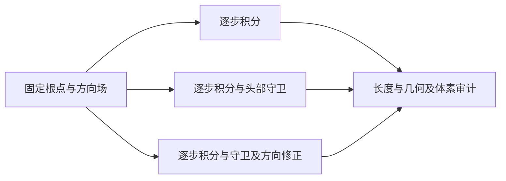

# 固定根点的头部约束逐步积分对照

日期：2026-09-06。样例：`0d285f5be7fa09c3dbbf1c9334047888`。

近头皮方向修正配合逐步守卫，使毫米级头部内侧轨迹降为零，同时基本保留非零生长根数；单独增加碰撞截断会造成大量根点无法生长。当前修正仍降低长轨迹保留率，不能宣称秃头或完整发型重建已解决。

## 📊 固定输入与结果

实验目录：[head_guard_comparison_20260906](../results/multiview_data/0d285f5be7fa09c3dbbf1c9334047888/pde_governance/volume_partition_integration/head_guard_comparison_20260906/)。[comparison.json](../results/multiview_data/0d285f5be7fa09c3dbbf1c9334047888/pde_governance/volume_partition_integration/head_guard_comparison_20260906/comparison.json) 是数值来源，[manifest.json](../results/multiview_data/0d285f5be7fa09c3dbbf1c9334047888/pde_governance/volume_partition_integration/head_guard_comparison_20260906/manifest.json) 保存所有输入路径和 SHA256。

固定使用 `mesh_front_128_partition_interface_repaired_iter4` 的方向场与 9,695 个 rebound 根点，固定根标签、原始 source_indices、根点顺序及坐标；不补根、不更改分区、不重新求解 PDE。每根预算为 64 步、每步 3 mm，总预算 192 mm。历史基线使用 `mesh_front_128_repaired_rk4_production/guarded_prefix_export/guarded_prefixes.npz`，加载时校验根点一致。

| 指标 | 历史前缀 | 逐步积分 | 逐步＋头部守卫 | 逐步＋守卫＋方向修正 |
| --- | ---: | ---: | ---: | ---: |
| 根数 | 9695 | 9695 | 9695 | 9695 |
| 跑满步数预算 | 3394¹ | 3380 | 607 | 2671 |
| 零长度根数 | 142 | 149 | 5038 | 140 |
| 有效长度超过 50 mm | 7909 | 7903 | 3504 | 8014 |
| 长度中位数（mm） | 141.00 | 141.00 | 0.00 | 131.99 |
| 任一采样点在头部内侧超过 1 mm 的根数 | 4073 | 4071 | 0 | 0 |
| 超过 3 mm 的根数 | 2639 | 2640 | 0 | 0 |
| 超过 10 μm 的根数 | 5698 | 5692 | 7 | 0 |
| 最小法线侧距离（mm） | -30.965 | -29.783 | -0.0143 | -0.00490 |
| 最终体素审计非法线段 | 本轮未重审 | 0 | 0 | 0 |

¹ 历史数量取原导出 report.json。`budget_exhausted` 仅表示未提前终止，不能解释为自然发梢或完整发型。新组每组审计 620,480 个线段，包含终止后的重复点；长度统计排除了重复点的贡献。

本轮独立几何审计沿线段以不超过 0.125 mm 的间距采样，因此历史穿入计数略高于前次只检查顶点的 4,029 根，不是历史结果发生变化。


## 🔎 终止原因

| 原因 | 逐步积分 | 加头部守卫 | 再加方向修正 |
| --- | ---: | ---: | ---: |
| 跑满步数预算 | 3380 | 607 | 2671 |
| 头部表面碰撞 | 0（未启用） | 5829 | 1 |
| 不同正分区交界 | 2357 | 762 | 2445 |
| 无标签或域外体素 | 3958 | 2497 | 4578 |

体素事件沿线段用现有保守 DDA 定位，包含角点和边上的相邻体素；接触到不同正标签才记为 `partition_interface`。实体体素、冲突体素、网格外和无效方向另有独立分类；本次未发生这些分类。多个体素原因同时接触时保留组合原因。头部碰撞在体素事件之前的线段范围内检查，若检测到则优先记录头部原因。

当前 bundle 中零标签没有足够信息进一步区分发体外部空气和未解析域，因此明确保留 `unlabeled_or_outside_domain`，没有猜成分区交界或自然发梢。后续要接入原候选域、排除域和实体语义再细分。

从逐步积分到方向修正，超过 50 mm 的根数增加 111，但跑满预算减少 709（约 21%），中位长度减少约 9 mm。几何修正改变了路径，使更多轨迹遇到零标签边界。不能以短轨迹保留率提升代替整体覆盖或长发质量改善。

## 🧪 实现与验证边界

新增独立脚本：[compare_head_guard_integration.py](../scripts/recon_3d/compare_head_guard_integration.py)。已有生产函数和默认入口未修改。



三组均使用最近邻场查询，避免把插值变化混入几何对照。RK4 子阶段如遇到不支持的分区或零方向，退回当前点的一阶候选，并继续对候选整段执行守卫；不存在越界后继续混合其他分区方向的更新。遇到违规时拒绝整个候选步并保留上一合法点，不输出可疑连接。根点从未被移动或删除，终止后的重复点用于定长存储。

头部守卫使用最近三角形法线侧距离，容差 10 μm，检查间距最多 0.25 mm。方向修正在 4 mm 表面带内移除向内分量，并用有限向外分量过渡到 1 mm 间隙，根部过渡距离为 6 mm。方向修正只改变候选方向，不投影或搬移根点。当前对照固定步长 3 mm，修正公式也按该步长设定，不能视为任意步长通用接口。

`data/head_model.obj` 不闭合。因此距离是局部法线侧测量，不能当作全局闭合实体 SDF；此外离散采样不是解析连续碰撞证明。更密的独立检查在仅守卫组发现 7 根有 10–14.3 μm 的内侧点，说明有必要保留这一限制。修正组没有超过 10 μm 的采样点，但并不据此宣称严格零碰撞。

本轮没有执行新 Blender 渲染、可见 silhouette 覆盖或真实图像方向误差评价。图中的长度覆盖仅指轨迹长度统计，不能替代可见头皮覆盖率。

测试命令：

```bash
PYTHONDONTWRITEBYTECODE=1 pixi run python -m pytest \
  tests/test_head_guard_comparison.py tests/test_rk4_partition_invariant.py \
  -q -o cache_dir=/tmp/hairstream-head-guard-pytest
```

结果：7 项通过。新增测试检查平面上的向内生长、根点不变、方向修正后继续生长，以及不同分区/实体/无标签接触归因；另运行已有分区不变量测试。测试期间 Taichi 提示用户缓存锁不可用，未影响测试通过。

GitNexus 影响分析对历史实验入口返回 `UNKNOWN / Target not found`，现有索引未覆盖该符号，不能据此报告调用范围为零。本轮只新增实验脚本、测试与报告，不修改既有符号，也不提交现有工作区内容。

## 🛠️ 复现与下一步

从项目根目录执行，输出目录必须不存在，避免覆盖先前实验：

```bash
experiment_base=results/multiview_data/0d285f5be7fa09c3dbbf1c9334047888/pde_governance/volume_partition_integration
PYTHONDONTWRITEBYTECODE=1 pixi run python scripts/recon_3d/compare_head_guard_integration.py \
  --field "$experiment_base/mesh_front_128_partition_interface_repaired_iter4/repaired_partition_field.npz" \
  --roots "$experiment_base/mesh_front_128_partition_interface_repaired_iter4/rebound_roots.npz" \
  --bounds "$experiment_base/mesh_front_64/candidate_domain_seeds.npz" \
  --bundle "$experiment_base/mesh_front_128_downgraded/trusted_partition_bundle_128.npz" \
  --baseline "$experiment_base/mesh_front_128_repaired_rk4_production/guarded_prefix_export/guarded_prefixes.npz" \
  --head data/head_model.obj \
  --output-dir "$experiment_base/head_guard_comparison_repeat"
```

下一步优先检查修正组 4,578 根零标签接触的空间分布，区分合理离开发体和错误侵蚀的头皮附近域；再检查 2,445 根真实分区接触是否应允许连续连接。保留这组几何约束作为实验对照，先完成域语义和可见渲染评价，不切换默认生产链路。
