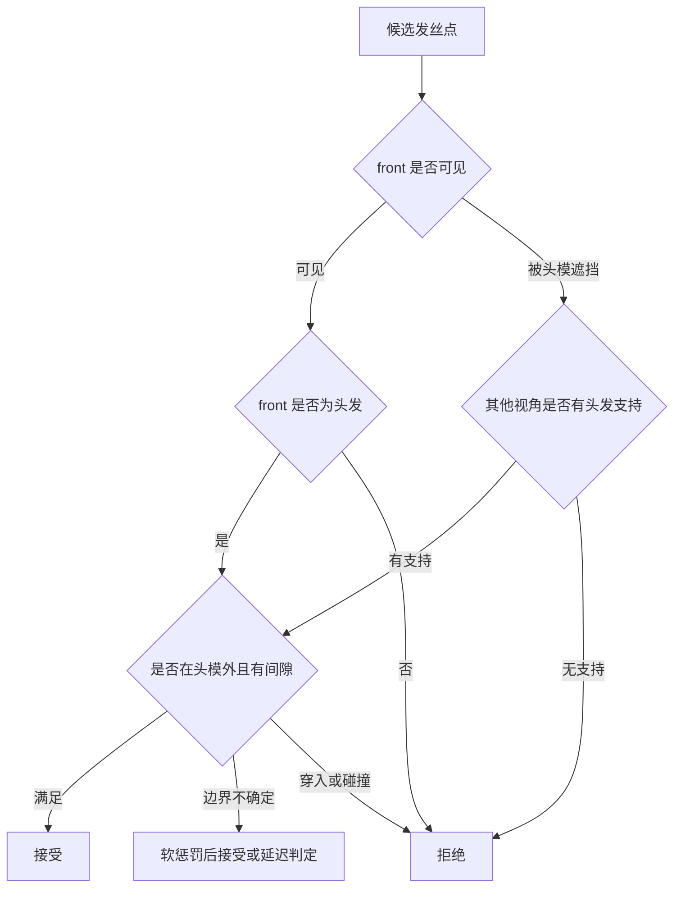
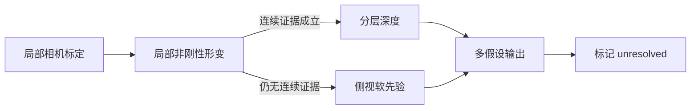

# 多视角头发证据冲突的通用判定结论

_HairStream3D 多视角重建排查结论，2026-09-12。本文记录原始 front 真值、GLB 先验与头模遮挡之间的通用处理规则。_

---

## 📋 背景

项目以单张原始正面图作为唯一可靠观测。left、right、back 图像来自 GLB 渲染和 FLUX 补全，只能提供侧面形状和发丝方向先验。此前左侧缺口排查中，发现同一片侧视头发在投影回原始 front 后，可能落到脸部或背景；若直接把侧视头发当作真值，系统会生成错误发丝；若把所有 front 非头发投影都硬拒绝，又会误删被头部遮挡的侧面头发。

排查还发现，ICP 曾使用不同 OBJ 读取器得到的顶点和面索引，污染了目标法线。修正索引后，左侧固定缺口的可行像素由 2,764 增至 4,255；加入原图投影约束后增至 5,526。耳前区域仍存在约 10–12 mm 的 GLB 与头模深度冲突，说明问题不是单一的头模缩放。

## 🔍 问题抽象

冲突应抽象为“多视角候选表面在不同可见性层中的证据不一致”，而不是某个固定部位的秃头问题。每个候选点必须同时携带几何位置、视角可见性、front 语义、侧视支持和头模距离。

## ✅ 通用判定规则

| 条件 | 处理 | 原因 |
| --- | --- | --- |
| front 可见且落在原图非头发区域 | 硬拒绝 | 原始 front 是唯一可见真值 |
| front 可见且落在原图头发区域 | 允许 | 有直接观测支持 |
| front 被头模遮挡，侧视有头发支持 | 允许 | front 无法判断遮挡层 |
| front 发际线附近少量越界 | 软惩罚 | 分割边界存在像素不确定性 |
| 没有可靠视角支持 | 不新增 | 不能从不可见区域推断头发 |
| 与头模穿插 | 硬拒绝或局部几何修正 | 保证碰撞和遮挡一致 |

“front 被遮挡”与“front 可见但非头发”必须严格区分。面级壳层过滤不能要求每个面在 front 中都可见；它只应拒绝 front 可见且明确为非头发的面，同时允许被头模遮挡、并得到侧视支持的面保留。

## 📊 当前证据与限制

面级过滤实验证明，若把所有 front 非头发或不可见面一起删除，耳前壳层会从候选中完全消失。这是过滤规则过严的结果，不能作为“耳前不存在头发”的证据。修正为“仅拒绝 front 可见非头发面”后，才能检验侧视壳层是否能在遮挡层中成立。

当前结论只适用于已有个体的诊断数据。有限射线采样、自动人脸关键点和 FLUX 侧视图都不能单独证明隐藏头皮的真实形状；任何局部形变都必须保留平滑性、碰撞间隙和跨视角一致性。

## 🚧 执行计划

1. 将可见性证据封装为统一状态：`front_visible_hair`、`front_visible_nonhair`、`front_occluded`、`unresolved`。
2. 修正壳层面级过滤，只对 `front_visible_nonhair` 执行硬 veto。
3. 对耳前、太阳穴和额角运行相同规则，禁止区域特例。
4. 重新检查 left、right、back 的覆盖和头模间隙，再决定是否进入完整发丝重积分。

## 🧭 后续探索方向

当前证据表明，单独修改头模尺度、放宽 front 分割阈值或直接复制完整 GLB 壳层都不能根治冲突。后续方案应从以下六个角度并行评估。

### 局部相机标定

固定眼、鼻、嘴等稳定区域，只优化耳前、太阳穴和额角相关的局部旋转、平移与正交尺度。使用未参与拟合的脸部关键点验证，防止局部变换只是在牺牲全脸对应。

### 分层深度表示

将几何分为脸部头模、头发外壳和发丝中心线三层。front 可见非头发只禁止最外层穿过脸部；front 被头模遮挡时，允许侧视头发壳层提供补全证据。

### 局部非刚性形变

仅允许耳前、太阳穴和额角发生小范围平滑形变，同时优化 front 投影误差、侧视轮廓、头模间隙、邻接平滑和 right/back 稳定性。2–6 mm 内可行通常表示局部配准或个体形状差异；超过 8–10 mm 则应怀疑侧视先验不可信。

### 侧视软先验

front 可见非头发保持强约束，front 被遮挡时侧视头发作为中等约束，仅有 FLUX 支持的位置使用低权重。纹理变化大或轮廓不稳定的区域应自动降低权重。

### 多假设结果

同时保留 front 优先、front 加侧视软约束和 GLB 形状优先三个结果，输出区域置信度和冲突原因。没有足够证据的区域标记为 `unresolved`，不强制补齐。

### 从方向场重新积分发丝

GLB 只提供方向、轮廓和长度先验，不直接作为最终头皮表面。最终发丝从头模外侧的发根分布、局部切向方向、长度证据和连续置信度场重新积分生成。

推荐顺序是：先做局部相机标定，再做 2–6 mm 局部非刚性形变；如果仍无法形成连续证据区，则启用分层深度和侧视软先验；最后再考虑多假设输出或保留 `unresolved` 区域。

