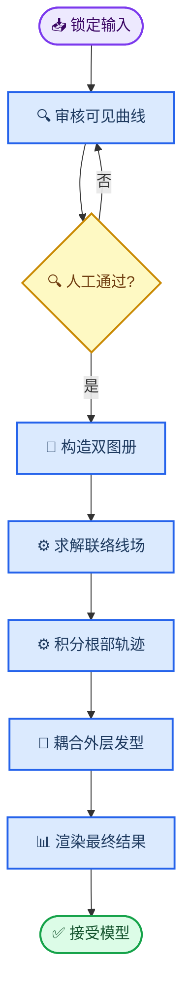
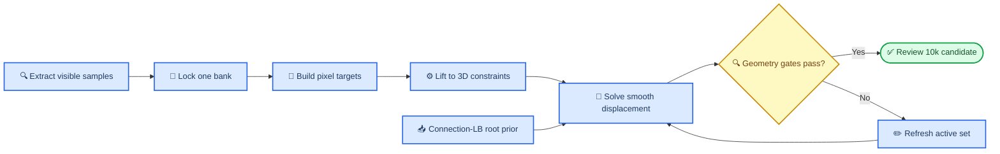

# 基于联络 Laplace–Beltrami 线场的发缝重建方案与逐步实验协议

_HairStream3D · 数学模型、真实样例实验与人工停点 · 2026-08-30_

---

## 📋 摘要

本文定义下一版显式发缝模型：在可见头皮曲面上构造有限宽度发缝空带，将左右两岸表示为带独立边界的曲面图册，再使用余切权重和 Levi-Civita 平行移动求解无符号二重角线场。该线场只负责根部切向导向；根部轨迹必须在连续三角面内积分，并携带不可丢失的侧别与图册状态，之后再平滑耦合既有外层发型。

方案不使用普通标量角度方程 `Δθ = 0`。局部切向标架会随曲面旋转，角度比较必须包含曲面联络；同时，发丝是 `t ≡ -t` 的无符号线场，沿发缝施加 `π` 跳跃不会产生几何分流。发缝首先被建模为有限宽度内部边界和根点禁区，奇点只用于发旋、交汇或必要的端点拓扑。

首轮实验固定使用 Image ID `0d285f5be7fa09c3dbbf1c9334047888`。实验严格分步执行，每一步完成后停止，只有人工检查通过才允许进入下一步。任何实验均不得覆盖现有 v24、v30 或其他历史结果。

## 🎯 目标与非目标

### 目标

- 在真实头皮三角网格上使用内蕴、网格几何感知的曲面线场算子
- 用真实 cut atlas 和有限宽度空带保证 cap 外不存在跨岸路径
- 使用 `q = exp(2iθ)` 消除二维与三维方向的正负号歧义
- 将可见发缝、strand map、两岸边界和已有外层发型作为不同置信度的约束
- 以物理弧长积分连续根段，不再沿网格顶点贪心游走
- 对最终完整发型检查发缝可见性，而非只检查新增局部发束
- 每一步产生独立、可检查、可回退的结果

### 非目标

- 第一轮不运行 `10,000` 根发束或 `128³` 全体积重建
- 第一轮不修改默认生产入口
- 不把单张 front 无法观测的后脑发缝当作确定真值
- 不在第一轮同时解决材质、头皮颜色和根影
- 不继续调节旧模型的 corridor、有限 penalty 或最终 trim
- 不把普通标量 cotangent Laplacian 误称为切向量场 connection Laplacian

## 🔍 当前样例与不可覆盖基线

### 样例标识

| 项目 | 固定值 |
| --- | --- |
| Image ID | `0d285f5be7fa09c3dbbf1c9334047888` |
| 头模 | `data/head_model.obj` |
| front 相机 | `results/multiview_data/0d285.../blender_renders/camera_params/front.npz` |
| front strand map | `results/multiview_data/0d285.../maps/strand_map/front.png` |
| front 头发 mask | `results/multiview_data/0d285.../maps/seg/front.png` |
| front 发缝 mask | `results/multiview_data/0d285.../pde_governance/front_parting_experiment/parting_mask.png` |
| 可见侧曲线候选 | `results/multiview_data/0d285.../pde_governance/scalp_geodesic_reference_v24/front_parting_scalp_curve.npz` |
| v30 外层基线 | `results/multiview_data/0d285.../pde_governance/pde_parting_hybrid_cap_v30/hair_multiview.ply` |
| v30 远侧曲线对照 | `results/multiview_data/0d285.../pde_governance/pde_parting_hybrid_cap_v30/front_parting_scalp_curve.npz` |

表中的 `0d285...` 均表示完整 Image ID。脚本和报告中必须保存完整路径，文档表格仅为缩短显示。

### 基线保护规则

- 所有新结果统一写入 `results/multiview_data/<image_id>/pde_governance/connection_lb_parting/`
- 每一步使用独立子目录 `step_XX_<name>/`
- 新脚本只能读取 v24、v30 和公共输入，不得覆盖它们
- 测试输出只能写入 `tests/outputs/connection_lb_parting/`
- 模型权重若未来产生，只能写入 `checkpoints/connection_lb_parting/`
- 所有命令通过 `pixi run` 执行

## ⚙️ 数学模型

### 可见发缝曲线与置信度

设头皮曲面为 `M`，视图集合为 `V`，二维发缝骨架为 `γ_v`，相机投影为 `Π_v`，同像素头模最近可见深度为 `D_v^front`。三维发缝曲线 `Γ(s) ⊂ M` 通过下式估计：

```math
E_Γ =
\sum_{v\in V}\sum_k c_{vk}
\rho\!\left(\|Π_vΓ(s_k)-γ_v(s_k)\|^2\right)
+λ_z\rho\!\left(z_v(Γ(s_k))-D_v^{front}(Π_vΓ(s_k))\right)^2
+λ_κ\int_Γ κ_g(s)^2\,ds.
```

对高置信度可见段施加硬门禁：

```math
Γ(s)\in M,
\qquad
\left|z_v(Γ(s))-D_v^{front}(Π_vΓ(s))\right|\le τ_{vis}.
```

隐藏段的置信度只能随离开可见区域而下降；低于阈值后曲线必须结束并进入有限 cap，不允许把 front 中心线无限外推到后脑。

### 有限宽度空带与双图册

设 `τ_Γ(s)` 为发缝切线，`n_Γ(s)` 为头皮切平面中垂直于发缝的横向。左右宽度分别为 `w_-(s)` 与 `w_+(s)`，空带定义为：

```math
B_Γ=
\left\{
\operatorname{Exp}_{Γ(s)}\!\left(rn_Γ(s)\right)
\mid -w_-(s)\le r\le w_+(s)
\right\}.
```

求解域为：

```math
M_Γ=M\setminus B_Γ.
```

离散时必须切分与两条岸边相交的三角形并复制边界顶点，得到 `M⁻`、`M⁺` 两张图册。每个顶点、三角面、根点和轨迹状态均保存 `chart_id ∈ {-1,+1}`。cap 外不建立跨图册邻接；cap 内只能通过显式过渡单元恢复连通。

### 无符号二重角线场

每个曲面顶点建立定向正交切向标架 `(e₁ᵢ,e₂ᵢ)`。发丝线方向满足 `t ≡ -t`，因此使用：

```math
q_i=e^{2\mathrm{i}θ_i}.
```

设 `ρᵢⱼ` 为从顶点 `j` 的切平面平行移动到顶点 `i` 后的标架旋转角，二重角传输为：

```math
R_{ij}^{(2)}=e^{2\mathrm{i}ρ_{ij}}.
```

余切权重为：

```math
w_{ij}=\frac{1}{2}
\left(\cot α_{ij}+\cot β_{ij}\right).
```

在同一图册内部求解：

```math
E(q)=
\frac{λ_s}{2}\sum_{(i,j)\in E_Γ}
w_{ij}\left|q_i-R_{ij}^{(2)}q_j\right|^2
+λ_o\sum_i c_i^{obs}|q_i-q_i^{obs}|^2
+λ_b\sum_{i\in\partial B_Γ}c_i^{bank}|q_i-q_i^{bank}|^2.
```

其中 `q_obs` 来自投影到头皮切平面的 strand map，`q_bank` 来自发缝两岸物理边界方向。该形式是 connection Laplacian，而非对裸角度执行普通标量 Laplace–Beltrami。曲面方向场的离散需要在 cotangent 型矩阵中显式包含相邻切平面之间的联络旋转。[^1]

### 两岸物理边界条件

左右岸不使用 `θ_left = α`、`θ_right = -α` 这类依赖参考坐标的约束。设两岸张开角为 `β_σ(s)`，则物理切向为：

```math
t_σ(s)=
\cos β_σ(s)\,τ_Γ(s)
+σ\sin β_σ(s)\,n_Γ(s),
\qquad σ\in\{-1,+1\}.
```

随后在局部标架中转换为：

```math
q_σ(s)=\left(t_{σ,1}+\mathrm{i}t_{σ,2}\right)^2.
```

`β_σ` 由 strand map 观测和向外分流先验共同确定，允许偏分、斜梳和左右不对称。`π` 方向翻转不作为发缝约束，因为对无符号线场而言 `θ` 与 `θ+π` 表示同一条几何方向。

### 奇点策略

普通发缝段作为内部边界，不作为连续奇点线。第一阶段允许以下位置成为奇点候选：

- 发旋或 cowlick 中心
- 多发缝交汇点
- cap 内无法通过平滑边界条件吸收的拓扑缺陷
- 线场模长接近零且网格加密后仍稳定存在的位置

任意候选必须输出位置、线场指数、局部置信度和网格细分稳定性。曲面方向场可以通过联络方法显式控制奇点，而不必预先把整条发缝指定成拓扑缺陷。[^2]

### 连续曲面轨迹

求解得到 `q` 后，从其主线方向恢复单位切向 `t`，再根据根点侧别选择符号。根部初始方向满足：

```math
t_i(0)\cdot\left(σ_i n_Γ\right)\ge 0.
```

轨迹在三角面内部使用重心坐标插值和物理弧长积分：

```math
\frac{dx_i}{dl}=t(x_i(l)),
\qquad \left\|\frac{dx_i}{dl}\right\|=1.
```

根部锁定区必须满足：

```math
\operatorname{chart}(x_i(l))=σ_i,
\qquad
x_i(l)\notin B_Γ,
\qquad
d_M(x_i(l))=h(l).
```

不得再以“选择夹角最大的相邻顶点”代替连续积分。连接 Laplace 场只负责根部导向；显式发束仍需几何连接、碰撞和图像约束。以 Laplace 场初始化显式发束、再优化发束几何，是已有数字毛发重建采用的可行分层方式。[^3]

### 外层发型耦合

根部线场记为 `Q_scalp = ttᵀ`，现有体积场或 v30 guide 的外层方向记为 `Q_outer`。目标场通过弧长和离面高度平滑混合：

```math
Q^*(x,l)=
\operatorname{Rank1Proj}\!\left[
χ(l,h)Q_{scalp}(x)
+(1-χ(l,h))Q_{outer}(x)
\right].
```

首轮不追加一层发束覆盖原结果，而是仅标记受发缝影响的既有发束。真正替换或重定向必须等到根部线场和连续轨迹通过人工检查后再执行。

## 🔄 分步实验与人工停点



### Step 0：方案与实验协议锁定

本步骤只创建本文档，不运行几何、PDE、发束或渲染实验。

**人工检查内容：**

- 数学模型是否采用 `q = exp(2iθ)` connection Laplacian
- 发缝是否作为有限宽度空带和双图册边界
- 是否接受 v24 可见侧曲线作为 Step 1 候选、v30 作为不可覆盖基线
- 分步顺序和每步停止规则是否符合预期

**通过条件：** 用户明确允许进入 Step 1。

### Step 1：可见近表面曲线审计

只比较 v24 与 v30 曲线，不求解任何新方向场。

**计算内容：**

1. 读取两条三维曲线和 front 相机
2. 对每个曲线点计算投影像素、相机深度和同像素头模所有交点
3. 记录其是否为最近可见交点、深度排名和法向朝向
4. 将曲线、发缝 mask、头模最近深度叠加到 front 图像
5. 输出推荐曲线，但不自动进入下一步

**输出目录：** `connection_lb_parting/step_01_visible_curve/`

**必须输出：**

- `curve_visibility_report.json`
- `v24_curve_front_overlay.png`
- `v30_curve_front_overlay.png`
- `curve_depth_comparison.png`
- `accepted_curve_candidate.npz`

**数值门禁：** 可见段远侧命中数为 `0`；近表面深度误差 `q95 ≤ 1 mm`；有效投影覆盖率不低于 `95%`。

**人工检查内容：** 曲线是否位于真实可见发缝、是否从前额合理延伸到冠部、是否出现跳到后表面或耳侧的点。

### Step 2：有限宽度空带与 cut atlas

本步骤只构造曲面域，不求解线场。

**计算内容：**

1. 焊接 triangle soup 并验证流形性和面朝向
2. 围绕通过 Step 1 的曲线裁剪冠部
3. 按初始宽度 `w₋ = w₊ = 4 mm` 构造两条测地岸线
4. 切分岸线相交三角形并复制边界顶点
5. 输出左右图册、空带和 cap 的独立颜色预览

**输出目录：** `connection_lb_parting/step_02_cut_atlas/`

**数值门禁：** cap 外跨图册邻接为 `0`；非流形边为 `0`；退化面为 `0`；两岸边界均为连续折线。

**人工检查内容：** 空带宽度是否符合发缝视觉宽度，岸线是否始终贴合头皮，cap 是否在合理位置闭合。

### Step 3：余切算子与联络一致性

本步骤只验证离散算子，不积分发束。

**计算内容：**

1. 构造 cotangent stiffness、lumped mass 和二重角 connection matrix
2. 检查矩阵 Hermitian 误差和无约束特征值
3. 使用制造解验证平行移动、常值线场和网格细分收敛
4. 比较原 `1 / edge_length` 图 Laplacian 与新算子的方向偏差

**输出目录：** `connection_lb_parting/step_03_operator_validation/`

**数值门禁：** Hermitian 相对误差 `≤ 1e-10`；Dirichlet 残差 `≤ 1e-8`；网格细分后有效区域方向 `q95` 差异 `≤ 5°`。

**人工检查内容：** 方向是否随曲面自然转动，是否仍出现明显网格轴向、棋盘格或局部翻转。

### Step 4：仅两岸边界的无符号线场

不使用 strand map，只验证发缝边界条件和全局平滑传播。

**计算内容：**

1. 设置若干 `β` 候选，例如 `30°`、`45°`、`60°`
2. 分别求解 `q = exp(2iθ)` 线场
3. 输出两岸箭头、无向线段、模长和奇点候选
4. 对全部边界输入乘以 `-1` 后重复求解

**输出目录：** `connection_lb_parting/step_04_bank_only_field/`

**数值门禁：** 符号翻转前后 `q` 差异 `≤ 1e-8`；cap 外跨岸耦合为 `0`；非候选奇点区域模长不低于标定阈值。

**人工检查内容：** 哪个 `β` 最接近目标发型；两岸是否自然分流；cap 是否出现旋转硬结或扇形爆炸。

### Step 5：加入 strand map 的观测引导

只加入 front 高置信度方向观测，不积分发束。

**计算内容：**

1. 将 front strand map 转为二维无符号张量
2. 通过投影 Jacobian 和头皮切平面构造 `q_obs`
3. 按可见性、mask 边界距离和方向响应构造置信度
4. 运行边界权重与观测权重的小型网格搜索

**输出目录：** `connection_lb_parting/step_05_observed_field/`

**数值门禁：** front 可见区域投影方向中位误差低于边界-only 基线；发缝两岸方向约束不被观测项破坏；隐藏区不使用伪高置信度观测。

**人工检查内容：** 发流是否保持输入图像的斜梳和弯曲，是否被纯向外边界过度拉成规则扇形。

### Step 6：256 根连续根部轨迹

本步骤只生成根部轨迹，不修改 v30。

**计算内容：**

1. 沿两岸按物理弧长和目标密度采样 256 个根点
2. 在三角面内以 `1 mm` 物理步长积分 `30 mm`
3. 保存 `chart_id`、面 ID、重心坐标和方向置信度
4. 按目标高度曲线将轨迹提升到头皮薄层

**输出目录：** `connection_lb_parting/step_06_root_traces/`

**数值门禁：** cap 前侧别违反为 `0`；空带进入数为 `0`；穿模点为 `0`；根点距离误差 `max ≤ 1 mm`；停滞轨迹为 `0`。

**人工检查内容：** 根段是否贴面、分岸是否清楚、开口是否随弧长合理、是否存在锯齿或成束聚集。

### Step 7：与 v30 的选区耦合

只处理根部投影落在发缝影响区的 v30 发束；原 v30 文件保持不变。

**计算内容：**

1. 标记遮挡发缝或根部位于影响区的既有发束
2. 将通过 Step 6 的根段与匹配外层尾段联合优化
3. 使用弧长、切向和曲率连续项约束交接
4. 输出替换前、局部替换层和合并后三个 PLY

**输出目录：** `connection_lb_parting/step_07_outer_coupling/`

**数值门禁：** 未选区发束点差为 `0`；交接角 `max ≤ 10°`；交接曲率跳变通过标定阈值；合并后无新增穿模。

**人工检查内容：** 全局轮廓是否保持，发缝附近是否过密、变黑或出现远距离交接。

### Step 8：最终相机可见性与多视图检查

只在前序步骤全部通过后执行渲染。

**计算内容：**

1. 渲染 front、left、right、back
2. 计算 front 发缝区域的头发遮挡率和头皮可见率
3. 计算投影方向误差、轮廓误差和多视图穿模
4. 与 v30、v4 groom 和新模型并排输出

**输出目录：** `connection_lb_parting/step_08_render_gate/`

**人工检查内容：** front 中是否真正形成目标发缝，侧视图是否出现空洞，后冠 cap 是否自然，全局造型是否优于或至少不劣于 v30。

只有 Step 8 通过后，才允许讨论 `10,000` 根或接入默认重建入口。

### Step 9：10,000 根规模验证

本步骤已由用户选择，仍属于隔离实验，不接入默认重建入口。完整 10k 基线固定为
`parting_topology_full_reconstruction_10k_128_20260828/hair_multiview.ply`，不得通过复制
v30 发束凑数，也不得覆盖该基线。

**Step 9A：10k 局部耦合候选。** 在完整 10,000 根基线上只替换 Step 6 对应的
256 根发缝影响区发束，其余 9,744 根逐点保持不变。沿用 Step 7 的同岸全局唯一匹配、
位置/切向/曲率五次交接以及穿模门禁。输出到
`connection_lb_parting/step_09_10k_scale/step_09a_outer_coupling/`，完成后必须人工检查并停止。

**Step 9B：10k 四视图规模门禁。** 只有 Step 9A 人工接受后才运行。沿用 Step 8 的
2 mm 统一物理采样与头模首交可见性检查，对完整 10k 基线和 Connection-LB 10k 候选做
front、left、right、back 对比，重点检查发缝是否因总密度变黑、侧面是否出现空洞、后冠
是否恶化，以及运行时间和输出体积。Step 9B 通过前不得接入默认入口。

### Step 10：遮挡优先的密度重建（Step 9B 失败后的修正支线）

Step 9B 已被人工拒绝：固定替换 256 根虽然满足三维交接门禁，但正面发缝可见率没有改善。
因此不能继续微调交接角或扩大影响半径，必须先把“根部接近发缝”改为“相机中真实遮挡发缝”。

**Step 10A：真实可见遮挡发丝审计。** 对完整 10k 基线和 Step 9A 候选沿用 Step 9B 的
`2 mm` 物理采样、头模首交深度测试和 `1 px` 占据足迹。只在
`parting_mask ∩ front seg` 中进行逐像素归因，输出所有实际遮挡发丝 ID、首次进入发缝的
弧长、前 `60 mm` 是否参与遮挡、共享像素的分数贡献以及旧 256 根的发丝召回率和像素
覆盖率。本步骤只读，不生成或修改任何发丝几何；预览必须使用 `raw_img.png`。

当前样例的 Step 10A 已执行并等待人工检查。候选中共有 1,288 根真实可见遮挡发丝，其中
487 根在前 `60 mm` 内参与遮挡，另有 801 根在更晚的弧长才进入发缝视线。Step 9A 的旧
256 根只命中其中 20 根，发丝召回率为 1.55%，只能解释 3.70% 的遮挡像素；按真实像素
贡献重新排序的前 256 根可覆盖 98.43%。基线与候选均遮挡 702/1,050 个发缝像素，验证了
Step 9A 没有改善发缝绝对可见率。以上仅为失败归因，不代表 Step 10B 已获准执行。

**Step 10B：遮挡优先的根部重定位。** 只有 Step 10A 人工确认后才实现。处理对象不再固定
为 256 根，而由 Step 10A 的真实遮挡集合和累计像素贡献决定。每根被处理发丝的原始根点
先投影到 cut atlas，再从该点积分 Connection-LB 场；发缝中心设置 `2–3 mm` 空带，密度在
`10–12 mm` 内平滑恢复。必须保持总数严格为 10,000，且以真实遮挡召回率和绝对头皮可见率
作为门禁，不得再用相对不恶化代替发缝形成。

Step 10B 的首个隔离候选已运行但**数值门禁失败**，不得进入默认流程。它尝试处理全部
1,289 根真实遮挡发丝，保留原始三维根点，以最近 atlas 投影处的 Connection-LB 轨迹提供
30 mm 位移，并在首次遮挡位置之后 20 mm 自适应接回原尾段。只有 971 根完成轨迹，另有
318 根撞到 atlas 边界；候选新增 18,800 个穿模点，且发缝头皮可见率仅从 33.14% 变为
33.24%，远低于 68% 门禁。原图预览还出现跨越额头的长桥，说明“把局部 atlas 位移平移到
任意原始根点并长距离接回尾段”在几何上不成立，不能靠继续调交接角或积分长度修复。

若继续修正，应另立 Step 10C，显式求解带相机可见性约束的三维体积发束变形或重新生成
遮挡层；该步骤不能再被描述为纯曲面根部 Laplace-Beltrami 模型，且必须先由用户确认。

### Step 10C：曲面先验与三维可见性约束的混合模型

Step 10C 不再假设曲面 PDE 能控制整根发丝。对基线发丝
\(\gamma_i^0(s)\) 引入三维位移场 \(u_i(s)\)，新发丝为
\(\gamma_i(s)=\gamma_i^0(s)+u_i(s)\)。Connection-LB 只约束靠近头皮的短根段，发丝
中后段由相机可见性与体积几何共同控制：

$$
\begin{aligned}
E(u) ={}& \lambda_{\mathrm{vis}}
\sum_{(i,k)\in\mathcal C} w_{ik}
\left\|J_\pi u_i(s_k)-\delta p_{ik}\right\|^2 \\
&+\lambda_{\mathrm{bend}}\sum_i\int\left\|u_i''(s)\right\|^2\,ds
+\lambda_{\mathrm{strain}}\sum_i\int\left\|u_i'(s)\right\|^2\,ds \\
&+\lambda_{\mathrm{LB}}E_{\mathrm{root}}
+\lambda_{\mathrm{head}}E_{\mathrm{collision}}
+\lambda_{\mathrm{shape}}E_{\mathrm{silhouette}}.
\end{aligned}
$$

其中 \(\mathcal C\) 是 Step 10A 得到的真实深度可见遮挡采样集合，
\(\delta p_{ik}\) 是离开发缝安全走廊的分岸像素位移，\(J_\pi\) 是正面相机投影
Jacobian。根点保持 \(u_i(0)=0\)，尾端使用软锚点而非长距离五次桥。碰撞项作用于全部
变形采样点，而不是只在交接点检查。



**Step 10C-1：三维可见性约束场审计。** 本步骤不求解 \(u\)，只构造并检查
\(\delta p_{ik}\) 和对应三维目标。每根发丝根据根点相对发缝曲线的符号锁定唯一岸侧；
目标离开“发缝 mask + 1 px 发丝足迹 + 2 px 安全边距”，同时保持正面相机 NDC 深度
增量为零。当前样例覆盖全部 1,289 根遮挡发丝，共生成 6,540 个约束点；所有目标仍位于
front `seg` 内，混合岸侧发丝数为 0，目标安全区违反数为 0。三维位移中位数为 7.76 mm，
q95 为 24.40 mm；较大的 q95 来自跨缝发丝，必须在下一步通过全局弯曲能量沿弧长分散，
不能直接逐点平移。

**Step 10C-2：稀疏三维位移求解。** 只有 Step 10C-1 人工接受后才实现。先固定根点，
使用二阶弯曲项和一阶应变项求每根发丝的带状稀疏最小二乘解，再进行头模碰撞检查和正面
绝对可见率评估。该步骤仍是隔离候选，不运行多视图，也不接入默认入口。

Step 10C-2 的一次性稀疏求解已运行但**数值门禁失败**。默认解覆盖全部 1,289 根遮挡
发丝并保持根点与未选区不变，轮廓、方向和 q95 转角变化通过门禁；但约束重投影残差 q95
为 10 px，新增 17,365 个穿模点，头皮可见率从 33.14% 降为 30.29%。随后只固定根点并
把可见性权重从 100 提升到 1,000，残差 q95 降至 4.31 px，但新增穿模升至 19,329，
头皮可见率进一步降至 29.81%，轮廓与转角也越界。该对照证明失败并非单纯权重不足；
一次性线性化会让未约束邻段进入发缝，并且没有在求解过程中阻止头模穿透。

**Step 10C-3：迭代可见性主动集与碰撞信赖域。** 只有 Step 10C-2 被人工拒绝并确认继续
后才实现。每轮必须重新光栅化当前候选、更新遮挡主动集，以小幅三维信赖域步长求解，并把
头模非穿透作为线性化不等式或投影约束。线搜索只接受“绝对头皮可见率单调提高、无新增
穿模且轮廓门禁保持”的更新；否则回退该轮，而不是继续增加可见性权重。

Step 10C-3 已按上述规则完成一次隔离实验。初始主动集仍为 1,289 根发丝、6,540 个约束点，
连续像素距离总量为 79,953.95。以 2 mm 为信赖域上限，分别试探比例 `1`、`0.5`、
`0.25`、`0.125`、`0.0625` 和 `0.03125`。所有试探均保持零新增穿模，轮廓与方向也未
越界，但没有一档形成可接受下降：2 mm 和 1 mm 步把绝对头皮可见率分别降为 32.76% 和
33.05%；0.5 mm 步虽然保持 33.14%，却把动态约束距离总量增至 80,923.89；更小步长的
可见率为 32.86%–33.05%。因此线搜索拒绝全部更新，最终候选严格回退为原始 10k 基线，
修改发丝数为 0。

该结果排除了“只因一次位移过大或缺少碰撞约束而失败”的解释。当前根侧锁岸的逐采样点
欧氏位移不是离散发缝占据率的下降方向：一根长发丝被整体平滑移动时，其非约束邻段会进入
发缝像素，而逐点目标没有表达这种自遮挡交换。下一模型若继续，应直接优化可微线段占据率，
或在二维投影中先求具有线段排斥和顺序约束的整条发丝目标，再提升到三维；不应继续调大当前
稀疏位移权重。

## 📊 统一报告字段

每一步的 `report.json` 至少包含：

| 字段 | 含义 |
| --- | --- |
| `image_id` | 完整 Image ID |
| `step` | 阶段编号和名称 |
| `inputs` | 输入绝对路径及内容摘要 |
| `config` | 所有非默认参数 |
| `metrics` | 本步骤完整数值指标 |
| `passed_numeric_gates` | 是否通过自动数值门禁 |
| `requires_human_review` | 固定为 `true` |
| `human_review_status` | `pending`、`accepted` 或 `rejected` |
| `outputs` | 供人工检查的文件路径 |
| `parent_step_report` | 上一步已接受报告路径 |

脚本不得因为数值门禁通过而自动运行下一步。人工状态没有明确标记为 `accepted` 时，后续脚本必须拒绝执行。

## ⚠️ 风险与回退

| 风险 | 检测 | 回退 |
| --- | --- | --- |
| 曲线落到远侧头模 | Step 1 深度排名 | 停留 Step 1，修复可见面选择 |
| 非 Delaunay 网格产生负权重问题 | Step 3 权重与谱检查 | 局部内蕴 Delaunay 重三角化 |
| 边界条件制造规则扇形 | Step 4 多 `β` 对照 | 降低边界权重，提前引入观测 |
| strand map 投影错误 | Step 5 重投影误差 | 拒绝低置信度视图或修正相机 |
| cap 产生奇点爆炸 | Step 4/5 模长与指数 | 缩短 cap 或显式设置端点奇点 |
| 连续积分仍跨岸 | Step 6 chart 状态 | 修复 atlas 穿越逻辑，不加 penalty |
| 外层 guide 覆盖不足 | Step 7 匹配距离与覆盖 | 改为选区重生成，不强行唯一匹配 |
| 三维指标通过但发缝不可见 | Step 8 遮挡率 | 回到 Step 7 替换遮挡发束 |

任一步失败都只回退到当前步骤或其直接上游，不修改已接受步骤的输出，也不通过最终 trim 掩盖失败。

## ✍️ 当前状态与下一动作

当前停在 **Step 10C-3：迭代可见性主动集失败候选**。Step 10C-2 已人工拒绝；Step 10C-3
在六档信赖域回溯下没有找到可见性下降步，自动门禁未通过，候选已回退为原始 10k 基线并
等待人工检查。在用户确认前，不进入可微线段占据率或二维整发丝目标模型。

## 🔗 参考资料

[^1]: Knöppel, F., Crane, K., Pinkall, U., & Schröder, P. (2013). “Globally Optimal Direction Fields.” _ACM Transactions on Graphics_. https://www.cs.cmu.edu/~kmcrane/Projects/GloballyOptimalDirectionFields/

[^2]: Crane, K., Desbrun, M., & Schröder, P. (2010). “Trivial Connections on Discrete Surfaces.” _Computer Graphics Forum_. https://www.cs.cmu.edu/~kmcrane/Projects/TrivialConnections/

[^3]: Takimoto, Y., Takehara, H., Sato, H., Zhu, Z., & Zheng, B. (2024). “Dr.Hair: Reconstructing Scalp-Connected Hair Strands without Pre-Training via Differentiable Rendering of Line Segments.” _CVPR_. https://openaccess.thecvf.com/content/CVPR2024/html/Takimoto_Dr.Hair_Reconstructing_Scalp-Connected_Hair_Strands_without_Pre-Training_via_Differentiable_Rendering_CVPR_2024_paper.html

---

_最后更新：2026-09-03_
