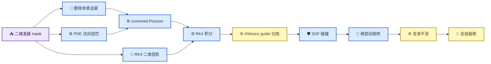
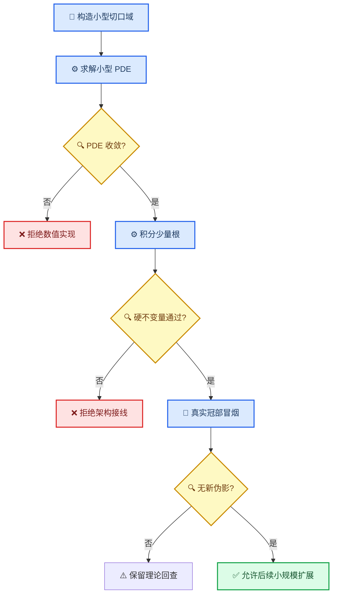

# PDE 发缝拓扑重建方案与冒烟测试计划

_HairStream3D · 理论设计与实施门禁 · 2026-08-26_

---

## 📋 摘要

当前发缝问题不能靠继续调 `corridor` 宽度、根部吸附距离或 RK4 修正强度彻底解决。现有 screened-Poisson 的内部界面项只惩罚方向场穿过界面的法向分量，但没有删除跨缝体素邻接；求解域在拓扑上仍是连通的。后续 RK4 又依次受到二维发缝投影、头皮 SDF 碰撞、guide 聚集、轮廓回滚、根部吸附和平滑的修改。这些操作不是同一个约束问题的联合求解，因此顺序和权重稍有变化，结果就会在“横向桥接”“发缝硬墙”“根段悬浮”之间切换。

本文把“彻底解决”定义为：离散算法本身能够保持发缝侧别和发根贴附不变量，而不是只在某个样例上视觉改善。本文推导三个候选架构，其中**方案 A：头皮切口双图册 + 根部薄层 PDE**最适合作为第一实施方案；**方案 B：嵌入式双层体素 + `Q` 张量 PDE**具有最强的无符号线场泛化能力，但实现成本最高；**方案 C：PDE 先验 + 受约束发束优化**适合作为保底修复层，但只能在优化器返回可行解时提供保证。

本阶段只完成理论闭环和冒烟协议，不修改重建代码、不运行 `10,000` 根或 `128³` 全量重建。只有方案通过本文的理论门禁，下一阶段才允许实现并执行小规模冒烟测试。

### 2026-08-26 冒烟实施结果

方案 A 的独立拓扑核心和 S0–S4 已完成，所有硬不变量通过。实现没有接入默认重建入口，也没有运行全量体素或完整发束采样。

| 场景 | 规模 | 关键结果 | 状态 |
| --- | --- | --- | --- |
| S0 平面 S 形切口 | 1,089 顶点 | 删除 73 条跨缝边；cap 外残留 `0`；PDE 残差 `7.74e-11` | 通过 |
| S1 半球根部薄层 | 256 根 × 24 点 | 侧别违反 `0`；停滞 `0`；前缀最大误差约 `5e-17 m` | 通过 |
| S2 端点 cap | 1,681 顶点 | cap 保留 13 条闭合边；最大单步转角 `4.29°` | 通过 |
| S3 符号翻转 | 256 个方向 | 随机翻转 136 个观测；张量和轨迹误差均为 `0` | 通过 |
| S4 真实冠部 | 3,537 顶点、256 根 × 30 点 | 删除 114 条跨缝边；PDE 残差 `9.59e-10`；侧别违反和停滞均为 `0` | 通过 |

S4 首次运行揭示 `data/head_model.obj` 是 triangle soup：`41,496` 个顶点恰好对应 `13,832 × 3` 个逐面独立顶点。未焊接图产生数百个无锚 PDE 分量并被门禁拒绝。局部裁剪后先焊接坐标重复顶点，再做两次拓扑保持细分，最终真实冠部图为 3,537 顶点和 6,848 面。该修复没有降低 PDE 收敛或拓扑门槛。

真实冒烟根部目标壳层距离为 `0.5 mm`，根距离最大值仍为 `0.5000000000001084 mm`，目标误差最大 `3.60e-8 m`；前 6 点薄层误差最大 `1.98e-7 m`。这说明“根点与前缀共享曲面坐标”能够同时消除悬浮和跨缝，而不需要最终 trim 删除症状。

当前决策是保留独立 S4 入口，不立即修改 `run_pde_multiview.py`。原因是 GitNexus 索引未收录当前主链路，相关 impact 为 `UNKNOWN`；在索引修复前强行接入不能满足仓库的影响分析门禁。输出位于 `tests/outputs/parting_topology_smoke/` 和真实 Image ID 的 `pde_governance/parting_topology_smoke/`。

## 🔍 当前系统为何无法收敛

### 现有约束落点



### 系统性失效原因

| 层次 | 当前做法 | 无法保证的原因 |
| --- | --- | --- |
| PDE 拓扑 | 在完整邻接图上加入有限权重的 `normal_penalty` | 扩散边仍跨越发缝，有限惩罚只能降低通量，不能令跨缝路径不存在 |
| 线场表示 | 先把无符号方向对齐成有符号向量，再逐步翻转 | 观测中的 `v` 与 `-v` 等价，但普通向量 PDE 和 RK4 会把符号接缝当成真实旋转 |
| 发缝几何 | 由 front 行中心线外推成三维界面 | 单张正面图的同一像素射线包含多个深度，后冠端点不可唯一观测 |
| RK4 修正 | 分别执行方向护栏、候选点投影、SDF 碰撞和冻结 | 这些投影一般不交换，也没有联合可行性求解；前一步满足的约束可被后一步破坏 |
| guide 聚集 | 全部发根可映射到最近的 front-visible guide | 左右侧别没有进入聚类键，同一 guide 可以把另一侧发束拉回发缝上方 |
| 根部后处理 | 将第 0 点投到距离 mesh 数毫米的壳面，再对若干点做线性位移 | 目标本身仍在头皮外；独立改点不能同时保持弧长、切向、曲率和侧别 |
| 最终截断 | 发现跨缝后冻结或折叠后续点 | 只删除症状，容易留下短桩、空洞和“从空气中开始”的视觉假根 |

代码证据集中在 `lib/multiview_pde.py` 的 `normal_penalty_weight`、`scripts/recon_3d/run_pde_multiview.py` 的 `hair_synthesis_rk4()`、`enforce_parting_interface_candidate()`、guide 聚类和根部吸附阶段。现有单元测试主要验证局部函数行为，例如“一个候选点能被推回原侧”，尚未验证完整链路中的拓扑不变量。

## 🎯 可证明的目标与观测边界

### 状态定义

设头皮曲面为 `S`，可见发缝中心曲线为 `Γ`，发缝后冠端点为 `e`。每个发根 `r_i` 具有侧别 `σ_i ∈ {-1,+1}`。用 `φ:S→R` 表示相对于 `Γ` 的有符号测地距离，左右两侧分别满足 `φ<0` 与 `φ>0`。第 `i` 根发束离散为 `x_i^0,...,x_i^K`。

“彻底解决”要求下列不变量由表示或离散邻接保证，而不是依赖视觉阈值：

1. **发根贴附：** `dist(x_i^0,S)=δ_root`，其中 `δ_root` 是渲染半径所需的小壳层距离，而不是任意的数毫米悬空高度
2. **根段贴附：** 前 `K_root` 个点位于头皮薄层中，并满足预定义的离面高度曲线 `h(j)`；不能只修正第 0 点
3. **侧别保持：** 在到达端点过渡区之前，`σ_i φ(π_S(x_i^j)) ≥ m(j) ≥ 0`
4. **端点闭合：** `Γ` 只在有证据或先验允许的端点处结束，左右图册在有限长度的 cap 区域中以 `C¹` 连续方式重新连通
5. **线场无符号性：** 输入 `v` 改成 `-v` 不改变最终几何轨迹
6. **后处理封闭性：** guide、碰撞、平滑和吸附均不得改变 `σ_i`，也不得把前 `K_root` 个点移出允许薄层

### 单张 front 的不可辨识部分

单张正面图只能可靠约束可见发缝和可见头发流。后脑勺的发缝端点、遮挡侧的头皮走向和相机射线方向上的深度都不是唯一解。因此，任何方法都不能对隐藏区域的真实发型作无条件保证。泛化方案必须显式维护置信度：可见段采用观测，隐藏段采用短程先验或多视图证据，并在不确定时尽早闭合发缝，不能把二维中心线一直外推到后脑勺。

## ⚙️ 方案 A：头皮切口双图册与根部薄层 PDE

### 核心构造

首先将二维发缝 mask 的骨架和宽度投影到可见头皮，得到曲面曲线 `Γ` 及逐点置信度。随后沿 `Γ` 切开头皮网格并复制切口两岸的顶点，使根部薄层变为带两张图册的离散域 `C_Γ`。切口只延伸到端点 `e`；两岸可以绕过 `e` 连通，但不存在直接跨越切口的网格边。

在切开的头皮上求解切向方向 PDE：

```math
E(t)=\int_{S_Γ} a\lVert\nabla_S t\rVert^2
+\lambda_o w_o\lVert t-d_o\rVert^2
+\lambda_n(t\cdot n)^2\,dA,
```

其中 `t` 是头皮切向根流，`d_o` 是 front 或可靠多视图观测。发缝两岸分别施加向外的边界方向；端点 cap 使用随测地弧长平滑衰减的边界权重。然后把切向场提升到头皮法向薄层，并以该薄层作为现有三维 screened-Poisson 的强边界：

```math
u(s,h)=\chi(h)\,[t(s)+\alpha(h)n(s)]
+[1-\chi(h)]u_{volume}(s,h).
```

积分状态不仅包含位置 `x`，还包含图册侧别 `σ` 和薄层高度 `h`。在根部薄层内只查询同侧图册；离开薄层后才与全局三维 PDE 场平滑混合。KMeans 或 guide 最近邻也必须先按 `σ` 分区，再在各自分区内聚类。

### 理论保证

离散积分从左侧图册的顶点出发时，所有允许的薄层邻接仍属于左侧；跨缝边已从图中删除，因此在抵达端点邻域之前不存在到右侧图册的离散路径。侧别保持由图的可达性保证，而不是由惩罚权重保证。发根点和前缀点直接采用曲面坐标 `(s,h)` 生成，因此贴附条件也由参数化保证。端点是否出现硬墙取决于 cap 的混合连续性，可通过要求 `χ_cap` 的一阶导数在两端为零获得 `C¹` 过渡。

### 泛化范围与代价

该方案自然支持弯曲、非直线、多个发缝以及不等宽发缝：每条发缝都是网格上的 cut graph。它也适合单视图，因为不可见段可以在曲面上按置信度结束。主要工程风险是切口网格质量、端点附近的非流形处理，以及从曲面薄层到现有体素坐标的插值。

## ⚙️ 方案 B：嵌入式双层体素与 Q 张量 PDE

### 核心构造

该方案保留体素表示，但不再把发缝当成普通 penalty mask。先在头皮附近建立相位场 `φ(x)`，然后对所有跨越 `φ=0` 且位于根部薄层内的体素邻接执行断边；必要时为界面体素复制左右两份未知量。端点区域通过显式的 cap 权重逐步恢复跨侧邻接。

为消除 `v` 与 `-v` 的符号问题，PDE 不直接求三维向量，而求结构张量 `Q=vvᵀ`：

```math
E(Q)=\sum_{(p,q)\in E_{cut}}a_{pq}\lVert Q_p-Q_q\rVert_F^2
+\sum_p\lambda_o w_p\lVert Q_p-Q_p^{obs}\rVert_F^2
+\sum_p\lambda_n n_p^TQ_pn_p.
```

RK4 查询 `Q` 的主特征向量，并只用上一段方向决定正负号。由于 `Q(v)=Q(-v)`，观测符号翻转不会制造假接缝。

### 理论保证

只要跨缝边从 `E_cut` 中严格删除，双层未知量在 cap 之前没有代数耦合，PDE 不能跨缝扩散。线场的无符号性由 `Q=vvᵀ` 的表示直接保证。需要额外证明或数值检查的是：求解后的 `Q` 保持半正定且接近秩一；若直接求六个独立分量，应在每次查询时做特征值投影。

### 泛化范围与代价

嵌入式方法无需修改头皮网格拓扑，适合复杂体素域、多条发缝和未来的学习型相位场。缺点是未知量从三个方向分量增加到六个对称张量分量，界面 cut-cell、预条件器和特征值投影均需新实现。它更适合作为方案 A 验证后的长期架构。

## ⚙️ 方案 C：PDE 先验与受约束发束优化

### 核心构造

该方案保留当前三维 screened-Poisson 作为全局方向先验，但不直接接受 RK4 输出。每根发束在根部前缀上求解联合变分问题：

```math
\min_x\sum_j
\lambda_f\lVert x^{j+1}-x^j-\ell\hat u(x^j)\rVert^2
+\lambda_c\lVert x^{j+1}-2x^j+x^{j-1}\rVert^2
+\lambda_s\,[dist(x^j,S)-h(j)]^2,
```

并施加硬约束：

```math
x^0=\pi_S(r),\qquad
\sigma\phi(\pi_S(x^j))\ge m(j),\qquad
0\le dist(x^j,S)\le h_{max}(j).
```

这不是把每个点独立吸到最近头皮，而是对整段曲线联合调整，从而同时保持弧长、曲率、侧别和贴附。可使用 SQP、增广拉格朗日或投影 Gauss-Newton；只有优化器返回满足容差的可行解才接收，否则整根回退到安全 guide。

### 理论保证与局限

若优化器收敛到可行点，硬不等式可以保证不跨缝和不悬浮。但非凸优化本身不能无条件保证找到可行解，因此该方案的保证是条件性的。它适合做最终安全层或方案 A 的曲率修正，不应单独替代拓扑切口。

## 📊 方案比较与实施选择

| 维度 | 方案 A：切口双图册 | 方案 B：双层体素 `Q` PDE | 方案 C：受约束曲线优化 |
| --- | --- | --- | --- |
| 跨缝保证 | 离散可达性保证 | 断边代数保证 | 可行解条件保证 |
| 根部贴附 | 曲面坐标直接保证 | 需结合薄层坐标 | 硬约束保证 |
| 无符号线场 | 需图册内符号传播 | 表示天然不变 | 依赖查询时符号跟踪 |
| 端点处理 | 网格 cap 清晰 | 体素 cap 较复杂 | 约束权重可平滑衰减 |
| 与现有 PDE 复用 | 高 | 中 | 高 |
| 实现与调试成本 | 中 | 高 | 中 |
| 多发缝泛化 | 高 | 高 | 中 |

第一实施候选确定为方案 A。原因不是它最容易，而是它同时满足“真正使用 PDE”“跨缝由拓扑保证”“根段由曲面坐标保证”和“能复用当前 screened-Poisson”四个条件。方案 C 作为同一阶段的可选曲率安全层；方案 B 保留为长期替代，只有当向量符号传播仍产生可见接缝时再启动。

## 🧪 非全量冒烟测试协议

### 理论进入实验的门禁

方案只有同时满足以下条件才允许编码：

- 能指出哪个离散邻接被删除或哪个硬约束排除了跨缝解
- 能说明发根第 0 点和前缀点如何由同一曲面坐标生成
- 能定义端点 cap，且不会把发缝无限延伸到后脑勺
- 能证明输入方向整体翻转不会改变轨迹几何
- 能规定 guide、碰撞和平滑如何保持侧别与根部薄层
- 能给出失败时拒绝结果的数值判据

方案 A 已在表示层满足上述证明义务，可以进入下一阶段的小规模实现；方案 B 也满足，但不作为首轮；方案 C 只能作为条件可行的辅助层。

### 冒烟矩阵

| 编号 | 数据与规模 | 目的 | 必须通过的断言 |
| --- | --- | --- | --- |
| S0 | `32×32` 平面网格、S 形切口、64 个根 | 验证 cut graph | cap 前跨缝边数为 `0`，左右可达集不相交 |
| S1 | 半球头皮、弯曲发缝、每侧 128 根、24 点 | 验证根部薄层 | 根点误差 `≤0.5 mm`，前 6 点薄层误差 `≤1 mm`，跨缝数为 `0` |
| S2 | 同一半球带显式端点 cap | 验证自然闭合 | cap 外不跨缝，cap 内方向连续，单步转角不超过设定上限 |
| S3 | 将 50% 观测方向随机乘以 `-1` | 验证线场不变性 | 输出几何与未翻转输入的平均点差低于离散误差 |
| S4 | `0d285...` 冠部裁剪、256 根、30 点、`64³` 或曲面 PDE | 验证真实数据接线 | 零桥接、零悬浮根、无批量冻结，不运行全头重建 |

S0–S3 的结果写入 `tests/outputs/parting_topology_smoke/`；S4 写入 `results/multiview_data/0d285f5be7fa09c3dbbf1c9334047888/pde_governance/parting_topology_smoke/`。不生成 `10,000` 根 PLY，不运行 `128³` 全域，不启用 KMeans、散度噪声、Laplacian 平滑或最终 trim，以免掩盖核心不变量。

### 统一度量



每次冒烟必须输出以下数值，而不能只看 Blender 渲染：

- PDE 初末相对残差、迭代数和 Dirichlet 最大误差
- cut graph 跨缝邻接数与左右可达集交集
- 根点到 mesh 的 `max/q95/q50` 距离
- 前缀点对目标薄层高度的 `max/q95` 误差
- cap 前侧别违反数和首次违反步数
- cap 区单步转角 `q95/q99/max`
- 零位移、冻结和低场发束数量
- 随机符号翻转前后的轨迹差

### 停止条件

以下任一情况出现即停止该候选，不通过增加 corridor、吸附强度或 trim 继续补丁：

- 任意一根在 cap 前发生侧别违反
- 任意根点距离头皮超过 `1.5 mm`
- cut graph 仍存在跨缝邻接
- PDE 未达到既定残差或强边界误差门槛
- 超过 `2%` 发束因界面冻结而成为短桩
- 分辨率从 `32` 提升到 `64` 后拓扑指标发生变化

## ✍️ 下一阶段落地顺序

### 2026-08-29 局部 groom 实验的新结论

`add-local-parting-groom-layer` 变更对 v30 做了四轮隔离实验。最重要的新发现不是 PDE 权重，而是发缝曲线的**可见面归属错误**：v28–v30 的 `front_parting_scalp_curve.npz` 在重建坐标中的 `z` 范围为 `-118～-41 mm`，转换到 front 相机后位于同像素头模深度分布的远侧。layer-only 渲染中，这些根段几乎全部被头模遮挡，说明所谓 front raycast 实际命中了后表面。

早期 v24 曲线的 `z` 范围为 `-55～79 mm`，从前额可见侧延伸到冠部。用它重建拓扑后，layer-only 发束首次在正面完整可见，并形成左右分流。这一对照把“后表面误命中”确定为 v28–v30 发缝长期不可见的重要原因。

| 实验 | 曲线/约束 | 30 mm 开口比 | 穿模点 | 正面观察 |
| --- | --- | ---: | ---: | --- |
| `smoke_v1` | v30 后侧曲线、无净空 | `1.126` | 未门禁 | 几乎完全被头模遮挡 |
| `smoke_v2_surface` | v30 后侧曲线、表面净空 | `1.177` | `0` | 仍不可见，证明不是单纯穿模 |
| `smoke_v3_visible_curve` | v24 可见侧曲线、顺序投影 | `2.284` | `16` | 正面可见并形成分流，但未通过门禁 |
| `smoke_v4_visible_alternating` | v24 可见侧曲线、交替投影 | `1.609` | `0` | 几何继续改善，仍缺完整导向覆盖 |

这组结果同时否定了“只向 v30 追加少量发束即可修复”的假设。v30 在可见发缝沿线缺少足量、连续且同侧的导向发束；唯一匹配会造成局部无导向或远距离交接，v4 的根部两岸覆盖率仅为 `43.75%`。下一阶段必须先修复 front raycast 的近表面选择，并对可见发缝选区内的原发束执行重定向或替换；不能继续在错误的后侧曲线上调 corridor、side penalty 或追加密度。

对应证据保存在：

- `results/multiview_data/0d285f5be7fa09c3dbbf1c9334047888/pde_governance/parting_groom_layer_smoke_v2_surface/`
- `results/multiview_data/0d285f5be7fa09c3dbbf1c9334047888/pde_governance/parting_topology_full_visible_v24_curve/`
- `results/multiview_data/0d285f5be7fa09c3dbbf1c9334047888/pde_governance/parting_groom_layer_smoke_v3_visible_curve/`
- `results/multiview_data/0d285f5be7fa09c3dbbf1c9334047888/pde_governance/parting_groom_layer_smoke_v4_visible_alternating/`

1. 为方案 A 建立独立 change，先实现通用的 scalp cut graph 与侧别标签，不接主重建入口
2. 在 `tests/` 添加 S0–S3 的小型合成冒烟；测试输出统一进入 `tests/outputs/`
3. 通过硬断言后，把切向表面 PDE 提升为根部薄层边界，并复用现有 screened-Poisson
4. 在所有将修改的现有符号前执行 GitNexus upstream impact；若为 `HIGH` 或 `CRITICAL`，先报告影响范围
5. 只对真实样例冠部执行 S4，关闭 KMeans、散度、噪声、平滑和 trim
6. S4 通过后再讨论是否恢复 side-aware guide 与造型项；本阶段不运行全量测试

> 📌 **实施边界：** 当前 OpenSpec 尚未初始化，因此本文先作为理论设计文档。进入代码阶段前，应创建明确的 change 或由用户确认直接按本文方案 A 开始最小实现；不能把本次探索直接扩展成全量重建。

## 🔗 内部依据

- [`PDE_RECONSTRUCTION_GOVERNANCE_PLAN.md`](./PDE_RECONSTRUCTION_GOVERNANCE_PLAN.md) — 真实 screened-Poisson 治理背景与数值门禁
- `lib/multiview_pde.py` — 当前三维 PDE、内部界面法向 penalty 和求解指标
- `lib/recon_strategy/weighted_poisson.py` — 当前 masked weighted screened-Poisson 离散实现
- `scripts/recon_3d/run_pde_multiview.py` — 发缝投影、RK4、guide、碰撞、吸附、平滑与 trim 主链路
- `tests/test_parting_root_attachment.py` — 当前局部行为测试及其覆盖边界

---

_最后更新：2026-08-26_
