# 多视角头发 PDE 重建治理与落地计划

_面向 HairStream3D 当前多视角重建链路的技术治理文档，重点恢复真实 PDE 求解、保住视觉基线并建立可量化的迭代门禁。_

---

## 📋 文档结论

当前多视角实现虽然命名为 `MultiViewLaplacePDEStrategy`，但最终方向场主要由最近边界 EDT 复制、固定次数 Gaussian 平滑和 mesh 法向裁剪得到，并未在多视角有效域上组装和求解离散 PDE。前面生成的 depth 融合结果还会在后续边界重建阶段被清空，因此继续调整 `pde_cg_tol`、`pde_alpha_mix` 等参数无法稳定改善结果。

本轮治理采用以下原则：

1. 保留当前视觉最好的完整 mesh 域作为回归基线
2. 将多视角求解器替换为真正的加权 screened-Poisson PDE
3. 将 front 作为强约束；side/back 必须先做符号一致化和夹角筛选，再比较软约束与筛选后强约束
4. 将 proxy 改为可见非头发区域的修剪依据，不再完全替代基线有效域
5. 将 RK4 的域边缘静默停滞改为可观测、可控制的边界行为
6. 只有同时通过数值收敛、几何连续性和视觉基线门禁，PDE 新链路才允许成为默认实现

> ⚠️ **命名门禁：** EDT 最近邻复制或 Gaussian 平滑可以作为 PDE 初值或求解后的轻量后处理，但不得再单独以“PDE 求解”命名。

### 当前实施状态

截至 2026-08-17，阶段 2 的真实 PDE 最小闭环与阶段 0 的 RK4 终止诊断已经落地：新增 masked weighted screened-Poisson matrix-free PCG，接入残差门禁、连通分量审计、物理尺度 SDF、终止原因统计和 `legacy_smooth` 回退模式。`128³` CUDA 求解在约 `0.25` 秒内收敛，当前最佳候选经过 125 次迭代，真实相对残差从 `1.838` 降至 `9.883e-5`。

实验确认 side/back 过度软化是当前主要瓶颈。将通过 60° 一致性筛选的 11,327 个 side/back 方向改为强 Dirichlet 后，最终发丝长度中位数从 soft-PDE 的 `19.75 cm` 提升到 `26.07 cm`，首次超过当前 `legacy_smooth` 的 `25.06 cm`；大于 20° 的段转角占比为 `10.97%`，仍低于旧链路的 `13.79%`。再加 30° RK4 转角上限后，q99 转角从 `117.61°` 降至 `30.35°`，中位长度保持 `25.95 cm`。

随后修复了 `pde_max_normal_component` 在 screened-Poisson 分支未接线的问题。恢复 mesh 法向限制并取折中值 `0.50` 后，候选结果达到长度中位数 `26.40 cm`、大于 20° 转角 `13.07%`、满 100 点比例 `8.80%`；这是当前综合指标最好的配置，但仍低于旧链路的满长度比例。

当前仍不切换默认实现：候选结果的满 100 点发丝比例为 `7.29%`，低于旧链路的 `16.17%`，并且 7,488/10,000 根发丝仍触发 silhouette stop。默认模式继续保持 `legacy_smooth`，下一步应治理根部到发梢的长程线场一致性，而不是继续增加域 padding 或 RK4 边界投影。

### 2026-08-17 消融决策记录

| 方案 | 关键结果 | 决策 |
| --- | --- | --- |
| soft-PDE 基线 | 长度 q50 `19.75 cm`，转角 >20° `5.44%` | 平滑但过短，保留对照 |
| RK4 硬域守卫 | 长度 q50 `32.60 cm`，边界投影 11,419 次 | 出现贴壁卷团，不采用 |
| RK4 柔性域守卫 | 长度 q50 `50.28 cm`，边界投影 57,605 次，转角 >20° `19.16%` | 明显过长并回卷，淘汰 |
| 全程 PDE fallback | silhouette stop `8,835` 根 | 域外最近方向会继续带偏轨迹，淘汰 |
| 纯局部 SDF continuation（1 mm） | 有效点 q50 `88.5`，长度 q50 `39.42 cm`，转角 >20° `21.65%` | 减少断尾但过度延伸，暂不启用 |
| 局部 continuation + 45° 方向门控 | silhouette stop `5,435` 根，效果接近无门控 | 无法提供可靠目标方向，暂不启用 |
| PDE 边界切向项 | silhouette stop 9,000 根 | 跟随锯齿域边界，默认关闭 |
| PDE 域 padding 2 体素 | 出域下降但 silhouette stop 8,019 根 | 只缓解零场，不改善投影轨迹 |
| side/back 筛选后硬约束 | 长度 q50 `26.07 cm`，转角 >20° `10.97%` | 当前最佳 PDE 主体 |
| side-hard + 30° 转角限制 | 长度 q50 `25.95 cm`，转角 q99 `30.35°` | 可靠候选 |
| side-hard + tangent05 + turn30 | 长度 q50 `26.40 cm`，转角 >20° `13.07%` | 当前综合候选 |

## 🔍 现状与根因

### 当前生成过程

```mermaid
flowchart LR
    accTitle: 当前多视角重建过程
    accDescr: 当前链路从原始正面图和 Pixal3D 模型出发，生成多视角方向边界和有效域，再通过伪 PDE 方向传播与 RK4 积分输出发丝。

    front_input[📥 原始 front 图] --> front_maps[⚙️ front 方向与蒙版]
    front_input --> pixal_model[⚙️ Pixal3D 模型]
    pixal_model --> align_model[🔧 DINOv3 与轮廓对齐]
    align_model --> render_views[⚙️ 渲染多视角]
    render_views --> synth_views[🧠 Flux side/back]
    synth_views --> side_maps[⚙️ side/back 方向与蒙版]
    front_maps --> sparse_boundary[📋 稀疏方向边界]
    side_maps --> sparse_boundary
    align_model --> mesh_band[📋 mesh 距离域]
    front_maps --> support_domain[📋 segmentation 支持域]
    side_maps --> support_domain
    mesh_band --> valid_domain[📦 三维有效域]
    support_domain --> valid_domain
    sparse_boundary --> pseudo_solver[⚠️ EDT 与 Gaussian]
    valid_domain --> pseudo_solver
    pseudo_solver --> rk4_growth[⚙️ RK4 发丝生长]
    rk4_growth --> style_ops[⚙️ 聚集与散度]
    style_ops --> strand_output([📤 PLY 与渲染])

    classDef input_style fill:#ede9fe,stroke:#7c3aed,stroke-width:2px,color:#3b0764
    classDef process_style fill:#dbeafe,stroke:#2563eb,stroke-width:2px,color:#1e3a5f
    classDef warning_style fill:#fef9c3,stroke:#ca8a04,stroke-width:2px,color:#713f12
    classDef output_style fill:#dcfce7,stroke:#16a34a,stroke-width:2px,color:#14532d

    class front_input input_style
    class front_maps,pixal_model,align_model,render_views,synth_views,side_maps,sparse_boundary,mesh_band,support_domain,valid_domain,rk4_growth,style_ops process_style
    class pseudo_solver warning_style
    class strand_output output_style
```



### 已确认的问题

| 问题 | 代码证据 | 直接后果 | 治理优先级 |
| --- | --- | --- | --- |
| 多视角未真正求解 PDE | `lib/multiview_pde.py` 使用 EDT 和固定次数 Gaussian | 稀疏边界以最近拥有者分区向全域传播 | P0 |
| PDE 参数未接入多视角求解 | CG、mix、anisotropy 参数只赋值未参与当前分支 | 调参无法控制数值解 | P0 |
| depth 融合结果被覆盖 | `run_pde_multiview.py` 后续重置 `fused_orien` 与 `boundary_mask` | neural depth 不影响最终多视角方向场 | P0 |
| side/back 成为硬边界 | 合成视角方向直接写入 Dirichlet 边界 | Flux 错误被全域扩散 | P0 |
| side residual 未被调用 | `_apply_side_residual()` 存在但未进入主流程 | 已设计的置信度保护没有生效 | P1 |
| proxy 域破坏生长走廊 | proxy 实验的域边缘提前停止率明显升高 | 发丝变短、稀疏并产生毛刺 | P0 |
| RK4 在低场区域静默停滞 | 有限步数 fallback 后允许零方向继续保存 | 大量短发和重复点尾部 | P0 |
| 后处理干扰核心诊断 | KMeans、散度和噪声与方向场同时开启 | 无法区分求解错误与造型错误 | P1 |
| 预览相机与 front 标定不同 | Blender 模板使用固定相机 | 视觉对齐评价可能产生偏差 | P1 |

### 当前实验基线

以下数据作为第一轮落地验收参考，不把单独的深度跨度视为成功标准。

| 指标 | 完整 mesh 基线 | proxy 域实验 | 目标方向 |
| --- | ---: | ---: | --- |
| 有效域体素 | 7,360,595 | 7,056,464 | 保持连通而非追求数量 |
| 发丝有效点数中位数 | 51 | 29 | 不低于基线 |
| 发丝长度中位数 | 28.1 cm | 12.5 cm | 不低于基线 |
| 满 100 点发丝比例 | 13.5% | 4.8% | 不低于基线 |
| 域边缘提前停止率 | 41.5% | 70.4% | 第一阶段低于 40% |
| 邻域方向差大于 20° | 6.73% | 7.45% | 低于基线 |

实验还表明，额外添加深度层可以恢复数值厚度，但会增加短刺和断裂。这说明根因是有效域连续性与方向场传播，不是一个可由全局 depth offset 独立解决的问题。

## 🎯 治理目标与边界

### 必须达成

- 多视角方向场必须由显式 PDE 算子求解得到
- 每次运行必须记录离散方程、未知量规模、迭代次数、初末残差和收敛状态
- front 约束必须保持稳定，side/back 不得作为无条件硬约束
- 有效域必须提供从 scalp root 向发梢延伸的连通生长走廊
- RK4 必须统计终止原因，不再产生不可解释的静默零速发丝
- 新实现必须能与完整 mesh 基线逐项对比并可一键回退
- 所有实验输出必须位于 `results/multiview_data/<image_id>/` 下
- 所有独立测试必须位于 `tests/`，测试产物必须位于 `tests/outputs/`

### 暂不纳入首轮

- 双马尾等拓扑复杂发型的专项适配
- 通过训练新网络直接替代 PDE
- 以更高体素分辨率掩盖算法缺陷
- 在基础场未通过门禁前优化 KMeans 造型参数
- 将 normalized monocular depth 直接解释为公制深度

## ⚙️ 真实 PDE 技术方案

### 第一版方程：加权 screened-Poisson

在头发有效域 \(\Omega\) 内，为三维方向的每个分量 \(u_c\) 求解：

\[
-\nabla\cdot\left(a(x)\nabla u_c(x)\right)
+ \lambda_s w_s(x)u_c(x)
= \lambda_s w_s(x)d_c(x),
\quad x\in\Omega
\]

其中：

- \(u(x)\) 是待求三维方向场
- \(a(x)\) 是空间平滑或各向异性扩散系数
- \(d(x)\) 是经过无符号方向一致化后的观测方向
- \(w_s(x)\) 是观测置信度，front 高，side/back 低
- \(\lambda_s\) 控制软观测对 PDE 解的影响

边界条件定义如下：

| 区域 | 条件 | 原因 |
| --- | --- | --- |
| 可信 front 表面 | 强 Dirichlet | 原始图是主观测 |
| scalp roots | 强 Dirichlet | 固定从发根出发的方向 |
| side/back 表面 | screened soft 或筛选后 Dirichlet | 合成视角必须先通过符号与夹角门禁 |
| 有效域外边界 | 零通量 Neumann | 避免边界被强制拉向零 |
| 脸、脖子、肩膀 | 从有效域剔除 | 不允许发丝穿入非头发区域 |
| 头部遮挡未知区 | 保持求解域 | 不把不可见误当背景 |

该方程离散后形成对称正定系统，可使用 CG 求解。第一版优先复用现有 Taichi CG 基础设施，但必须重新验证掩码域、各向异性体素间距、Dirichlet 消元和 Neumann 边界实现，不能直接假定旧实现正确。

### 第二版方程：切向耦合与双调和平滑

第一版通过验收后，再引入：

\[
E(u)=
\int_{\Omega}
\alpha\lVert\nabla u\rVert^2
+\beta\lVert\Delta u\rVert^2
+\lambda_t(n^T u)^2
+\lambda_s w_s\lVert u-d\rVert^2\,dx
\]

其中 \((n^T u)^2\) 把 mesh 切向约束纳入能量，而不是在求解结束后大范围强行裁剪方向。\(\beta\) 双调和项只在 screened-Poisson 已经稳定后启用，因为它需要更严格的边界条件和预条件器。

### 无符号线场处理

头发局部方向是线场，\(d\) 与 \(-d\) 表示相同纹理方向。进入 PDE 前必须先完成符号一致化：

1. 从 scalp root 和可信 front 建立种子方向
2. 在观测图或体素邻接图上传播符号
3. 对 side/back 选择与当前参考方向夹角较小的符号
4. 拒绝超过置信角阈值的合成视角观测
5. PDE 求解后按照 root-to-tip 方向再次定向并归一化

如果向量形式仍出现符号接缝，后续升级为结构张量 \(Q=dd^T\) 的 PDE，再从主特征向量恢复方向；该方案不作为第一版阻塞项。

### 求解器真实性门禁

满足下列全部条件，才允许日志中打印 `PDE solved`：

- 明确构造离散 PDE 算子或等价 matrix-free stencil
- PDE 算子在内部未知体素上实际执行
- CG 或其他线性迭代器至少执行一次，除非初始残差已低于容差
- 输出 \(\lVert Au-b\rVert/\max(\lVert b\rVert,\epsilon)\)
- 输出求解器退出码、迭代次数和耗时
- 验证强 Dirichlet 边界误差低于指定容差
- Gaussian 不参与残差收敛判定
- EDT 仅允许生成初值，不允许作为最终场

建议每次运行在实验目录写入 `pde_solver_metrics.json`，至少包含：

```json
{
  "solver": "weighted_screened_poisson_cg",
  "resolution": 128,
  "unknown_voxels": 0,
  "iterations": 0,
  "initial_relative_residual": 0.0,
  "final_relative_residual": 0.0,
  "converged": false,
  "dirichlet_max_error": 0.0,
  "elapsed_seconds": 0.0
}
```

## 🏗️ 目标架构

```mermaid
flowchart LR
    accTitle: 目标 PDE 重建架构
    accDescr: 目标架构以完整 mesh 基线域为起点，通过置信度观测和真实 screened-Poisson 求解生成连续方向场，再由具备边界感知能力的 RK4 生长发丝。

    aligned_geometry[📥 对齐几何] --> baseline_domain[📦 基线 mesh 域]
    visible_nonhair[📥 可见非头发证据] --> carve_domain[🔧 置信度修剪]
    baseline_domain --> carve_domain
    carve_domain --> connected_domain[✅ root 连通有效域]
    front_evidence[📥 front 强观测] --> sign_align[🔧 线场符号一致化]
    side_evidence[📥 side/back 软观测] --> sign_align
    sign_align --> pde_constraints[📋 PDE 边界与源项]
    connected_domain --> pde_solver[⚙️ screened-Poisson CG]
    pde_constraints --> pde_solver
    pde_solver --> convergence_gate{🔍 数值收敛?}
    convergence_gate -->|否| reject_result[❌ 拒绝结果]
    convergence_gate -->|是| normalized_field[✅ 连续方向场]
    normalized_field --> sdf_rk4[⚙️ SDF 感知 RK4]
    connected_domain --> sdf_rk4
    sdf_rk4 --> quality_gate{🔍 超过基线?}
    quality_gate -->|否| keep_baseline[⚠️ 保留基线]
    quality_gate -->|是| enable_styling[⚙️ 恢复造型项]
    enable_styling --> final_strands([📤 最终发丝])

    classDef input_style fill:#ede9fe,stroke:#7c3aed,stroke-width:2px,color:#3b0764
    classDef process_style fill:#dbeafe,stroke:#2563eb,stroke-width:2px,color:#1e3a5f
    classDef decision_style fill:#fef9c3,stroke:#ca8a04,stroke-width:2px,color:#713f12
    classDef success_style fill:#dcfce7,stroke:#16a34a,stroke-width:2px,color:#14532d
    classDef danger_style fill:#fee2e2,stroke:#dc2626,stroke-width:2px,color:#7f1d1d

    class aligned_geometry,visible_nonhair,front_evidence,side_evidence input_style
    class baseline_domain,carve_domain,sign_align,pde_constraints,pde_solver,sdf_rk4,enable_styling process_style
    class convergence_gate,quality_gate,keep_baseline decision_style
    class connected_domain,normalized_field,final_strands success_style
    class reject_result danger_style
```



## ✍️ 分阶段落地计划

### 阶段 0：冻结基线与诊断口径

目标是避免后续出现“视觉似乎更好，但无法确认是哪一步造成”的情况。

- [ ] 固化完整 mesh 基线配置和随机种子
- [x] 固化样本 `0d285f5be7fa09c3dbbf1c9334047888` 的输入与相机参数
- [ ] 保存无 KMeans、无散度、无噪声的 core-field 基线
- [ ] 统一使用原始 front 标定相机生成几何 overlay
- [x] 新增发丝终止原因、有效长度、曲率和边缘停滞统计
- [ ] 输出阶段级配置快照和 `metrics.json`

完成门禁：同一配置重复运行的核心指标误差在约定范围内，且产物全部进入样本实验目录。

### 阶段 1：治理有效域

- [ ] 以完整 Pixal3D mesh 距离带恢复视觉基线域
- [ ] proxy 只用于剔除 front 可见的脸、脖子和肩膀
- [ ] head-occluded 区域采用 abstain，不当作背景剔除
- [ ] 从 scalp roots 做连通域分析
- [x] 删除小型孤立体素组件
- [x] 为有效域计算带物理体素间距的 SDF
- [ ] 输出 root corridor 长度分布和域切片可视化

完成门禁：root 覆盖率不低于基线，域边缘提前停止率具备下降趋势，且 front 轮廓没有明显扩张。

### 阶段 2：实现 screened-Poisson 最小版本

- [x] 将 PDE 算子封装为独立求解模块
- [x] 实现 masked-domain 7 点 stencil
- [x] 按世界坐标体素间距缩放各轴系数
- [x] 实现 front/scalp Dirichlet 条件
- [x] 实现有效域外边界的零通量 Neumann 条件
- [x] 支持 EDT 初值与零初值对照
- [x] 使用 CG 求解三个方向分量
- [x] 输出完整收敛指标；逐迭代残差曲线仍待补充
- [x] 保留 `legacy_smooth` 回退模式，但明确标为非 PDE

建议代码归属：

| 内容 | 目标位置 |
| --- | --- |
| PDE 算子与 CG 封装 | `lib/recon_strategy/weighted_poisson.py` |
| 多视角策略接入 | `lib/multiview_pde.py` |
| 参数与模式选择 | `scripts/recon_3d/run_pde_multiview.py` |
| 数值单元测试 | `tests/test_weighted_poisson_pde.py` |
| 可视化诊断 | `scripts/vis/` 对应 PDE 子类脚本 |

完成门禁：解析测试和制造解测试通过，真实样本最终相对残差达到设定容差，且 Dirichlet 边界没有漂移。

### 阶段 3：多视角置信度约束

- [x] front 方向作为强 Dirichlet 或极高权重观测
- [x] side/back 改为 screened soft constraint
- [x] 接入方向夹角过滤和符号一致化
- [ ] 将 segmentation 可见性转换为观测置信度
- [ ] 将 Flux 生成区域与原始观测区域分开计权
- [ ] 消除当前融合结果被清空重建的重复路径
- [ ] 明确 depth 仅用于几何定位、ray interval 或置信度，不直接充当方向
- [x] 对 side/back soft、增强 soft 与筛选后 hard 做消融实验
- [ ] 对 front-only、front+side、front+all 做完整视角集合消融

完成门禁：加入 side/back 后 front 投影不得劣化，侧后方方向覆盖提升，且邻域大角度跳变不高于基线。

### 阶段 4：RK4 边界感知与终止治理

- [x] 每一步同时查询方向场和有效域 SDF
- [x] 临近域边界时移除指向域外的方向分量
- [x] 在窄带内实验切向滑行和投影回有效域；因回卷伪影不启用
- [ ] 用空间条件替换固定 12 步 fallback
- [x] 记录 `silhouette_exit`、`field_zero`、`domain_exit` 和有效点数；`head_collision` 仍待补充
- [ ] 默认过滤极短或重复点占主导的发丝
- [ ] 保持 silhouette guard 作为图像约束，不让它代替三维有效域

完成门禁：域边缘提前停止率低于 40%，有效长度中位数不低于完整 mesh 基线，短刺比例下降。

### 阶段 5：切向耦合与造型恢复

- [x] 实现 PDE 法向惩罚能量并完成域边界消融；因离散域边界非物理表面而默认关闭
- [ ] 评估双调和项对曲率和长程连续性的改善
- [ ] 在核心方向场通过门禁后逐项恢复 divergence、noise 和 KMeans
- [ ] 若需要聚集，优先使用三维 guide 或带深度置信度的聚类
- [ ] 造型力随 PDE 场可信度和发丝生命周期衰减
- [ ] 保存无造型与有造型的配对结果

完成门禁：造型项不得重新引入明显折线、深度压扁或发梢横向拖拽。

### 阶段 6：默认切换与清理

- [ ] 在代表性样本集上完成回归
- [ ] 将新 PDE 模式设为默认
- [ ] 保留一个发布周期的 `legacy_smooth` 回退入口
- [ ] 删除或废弃无效的 PDE 参数映射
- [ ] 更新 `MULTIVIEW_FUSION_PLAN.md`，标注历史方案与新治理文档关系
- [ ] 更新运行说明和输出数据规范

完成门禁：数值、几何和视觉三类验收全部通过，并完成代码影响分析和回归检测。

## 🧪 测试与验收体系

### 数值 PDE 测试

| 测试 | 构造 | 验收标准 |
| --- | --- | --- |
| 常量 Dirichlet | 立方域边界为同一向量 | 内部保持常量 |
| 线性调和场 | 对立面设置线性边界 | 离散解接近解析线性场 |
| screened 制造解 | 已知 \(u\) 反推右端项 | L2 误差随分辨率下降 |
| 非立方体素 | 三轴物理间距不同 | 不出现轴向偏置 |
| Neumann 外边界 | 零通量边界 | 法向数值通量接近零 |
| Dirichlet 保持 | front/scalp 固定值 | 最大误差低于容差 |
| 初值独立性 | EDT 与零初值 | 收敛到同一解 |
| 收敛失败 | 极低迭代上限 | 明确失败且拒绝伪装成功 |

### 三维场测试

| 指标 | 含义 | 第一阶段门禁 |
| --- | --- | --- |
| PDE relative residual | 方程是否真的求解 | 达到配置容差 |
| 邻域方向角 q90/q99 | 局部平滑性 | 不高于基线 |
| 大于 20° 邻接比例 | 方向接缝 | 低于 6.73% |
| root corridor 覆盖率 | 根部是否有连续域 | 不低于基线 |
| 有效域主连通分量占比 | 域是否碎裂 | 接近 100% |
| head penetration | 是否穿入头模 | 不高于基线 |

### 发丝与视觉测试

| 指标 | 基线 | 新链路目标 |
| --- | ---: | ---: |
| 有效长度中位数 | 28.1 cm | 不低于基线 |
| 域边缘提前停止率 | 41.5% | 低于 40% |
| 满长度发丝比例 | 13.5% | 不低于基线 |
| front silhouette IoU | 待冻结 | 不低于基线 |
| side/back silhouette IoU | 待冻结 | 提升且不牺牲 front |
| 短刺比例 | 待补统计 | 显著下降 |

所有视觉比较至少包含：

1. 原始 front 标定相机的 mesh/strand overlay
2. 固定 canonical front、left、right、back 四视角
3. 无 KMeans 和无散度的 core-field 渲染
4. 恢复造型项后的最终渲染

## ⚠️ 风险、回滚与决策门禁

| 风险 | 表现 | 缓解方案 |
| --- | --- | --- |
| 高分辨率 CG 内存或耗时过高 | 128³ 以上运行变慢 | matrix-free stencil、预条件 CG、多分辨率 warm start |
| side/back 软约束仍污染 front | front 轮廓或分缝偏移 | 降低权重、角度拒绝、front 保护区 |
| 方向归一化破坏线性解 | 外循环震荡 | 固定点迭代并监控能量与残差 |
| Neumann 边界产生漂移 | 场存在零空间 | front/scalp Dirichlet 保证锚定 |
| proxy carve 过度 | 生长走廊再次断裂 | 仅对高置信可见非头发执行修剪 |
| 切向项过强 | 头发贴壳、深度被压扁 | 将切向约束纳入消融并限制空间作用域 |
| 数值指标提升但视觉下降 | 出现深度层实验同类问题 | 三类门禁必须同时通过，不以单指标切换默认 |

每一阶段都必须保留：

- 完整 mesh 视觉基线配置
- `legacy_smooth` 对照模式
- 同相机、同 roots、同随机种子的配对输出
- 阶段失败时可恢复的配置入口

出现以下任一情况时不得进入下一阶段：

- PDE 未收敛或未输出残差
- front overlay 明显劣于基线
- 有效长度中位数下降超过允许范围
- 域边缘停止率继续上升
- side/back 改善只能通过牺牲 front 获得

## 📍 推荐执行顺序

```mermaid
flowchart LR
    accTitle: PDE 治理执行顺序
    accDescr: 治理工作先冻结基线和诊断，再依次完成有效域、真实 PDE、多视角软约束、RK4 边界治理与造型恢复。

    freeze_baseline[📋 冻结基线] --> observe_failures[🔍 建立诊断]
    observe_failures --> govern_domain[🔧 治理有效域]
    govern_domain --> solve_pde[⚙️ 实现真实 PDE]
    solve_pde --> soften_views[🔧 接入软约束]
    soften_views --> fix_rk4[⚙️ 修复 RK4 边界]
    fix_rk4 --> restore_style[🎨 恢复造型]
    restore_style --> regression_gate{🔍 三类门禁?}
    regression_gate -->|通过| switch_default([✅ 切换默认])
    regression_gate -->|失败| keep_control([⚠️ 保留基线])

    classDef process_style fill:#dbeafe,stroke:#2563eb,stroke-width:2px,color:#1e3a5f
    classDef decision_style fill:#fef9c3,stroke:#ca8a04,stroke-width:2px,color:#713f12
    classDef success_style fill:#dcfce7,stroke:#16a34a,stroke-width:2px,color:#14532d

    class freeze_baseline,observe_failures,govern_domain,solve_pde,soften_views,fix_rk4,restore_style process_style
    class regression_gate,keep_control decision_style
    class switch_default success_style
```



最小可交付单元不是“渲染出一张新图”，而是完成阶段 0 至阶段 2：拥有可重复基线、真实 masked-domain PDE、解析测试、收敛日志以及同条件视觉对照。在此之前不继续扩大深度层、提高分辨率或叠加造型力。

## 🔗 代码与文档索引

- [`lib/multiview_pde.py`](../lib/multiview_pde.py)：当前多视角方向场传播实现
- [`lib/recon_strategy/laplace_pde.py`](../lib/recon_strategy/laplace_pde.py)：旧版 Taichi CG 与 PDE 基础设施
- [`lib/multiview_fusion.py`](../lib/multiview_fusion.py)：相机、投影、可见性与多视角融合
- [`scripts/recon_3d/run_pde_multiview.py`](../scripts/recon_3d/run_pde_multiview.py)：多视角重建主入口与 RK4 生长
- [`docs/MULTIVIEW_FUSION_PLAN.md`](MULTIVIEW_FUSION_PLAN.md)：早期多视角融合方案
- [`docs/SILHOUETTE_GUARD.md`](SILHOUETTE_GUARD.md)：轮廓保护设计
- [`docs/hair_generation_pitfalls.md`](hair_generation_pitfalls.md)：现有发丝生成陷阱记录
- [`docs/MULTIVIEW_DATA_SPEC.md`](MULTIVIEW_DATA_SPEC.md)：多视角结果目录规范

---

_最后更新：2026-08-17 · 状态：实施中，阶段 2 最小闭环完成，side-hard + tangent05 + RK4 turn30 为当前 PDE 候选；局部 continuation 待接入可靠观测方向_

### 最近一次诊断补充（2026-08-17）

当前候选的 RK4 统计显示，`domain_exit_before_silhouette=9638/10000`、`low_field_before_silhouette=9364/10000`，说明主要瓶颈不是 PDE 线性求解不收敛，而是头发轨迹很快离开由多视角 mask 构造的有效域。将 SDF 法向或全局 fallback 当作继续生长方向会把轨迹吸到域边界并产生过长卷曲，因此局部 continuation 暂不纳入默认配置。

当前应优先构造“根部连接的观测走廊”：从 front-visible roots 出发，沿各视角可观测 strand/depth 方向建立有限半径的局部 corridor，并只在 corridor 内允许 PDE 方向延拓；缺少可靠观测方向时应停止或降权，而不是使用全局最近方向。现有 root guidance 中 front 可见根为 `5129/10000`，该统计将作为走廊覆盖率的基准。

本轮已将 front 发缝检测从“固定宽度暗线”升级为二维可见头皮区域。`scripts/vis/detect_front_parting.py` 默认融合原图 Lab 头皮色度、4 px 局部亮脊和 DINOv3 patch 一致性：先用动态规划追踪弯曲中心，再逐行扩张至真实亮度/色度边界，最后分别平滑左右边界。因此输出宽度可随发缝形状变化，不再假设发缝是一条直线。DINOv3 只参与低分辨率区域定位，像素级轮廓仍由原始图像决定；模型不可用时自动回退 RGB/Lab，历史算法可用 `--mode legacy_line` 显式复现。

在 `0d285f5be7fa09c3dbbf1c9334047888` 上，迁入后的默认检测覆盖第 `68..160` 行，中位宽度 `10 px`，中心中位数约为 `x=276`，与人工确认的弯曲发缝区域一致。该 mask 仍通过 PDE 入口的 `--front_parting_mask` 显式传入，职责是提供 front 观测禁区；后续三维发缝走廊和根部贴附必须继续接受完整重建与多视角渲染验证。
