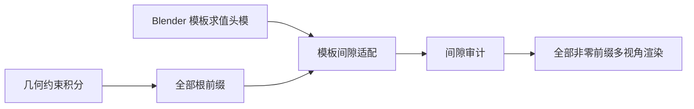

# 重建文档导航

本文按用途整理文档和代码入口。带日期的结果报告保留实验条件与局限，不能相互替代；`results/` 中的网格、渲染和统计为本地实验产物，不随源码提交。

## 当前阅读顺序

| 用途 | 文档 |
| --- | --- |
| 修复 Blender 预设头模穿入，含复现命令 | [模板头模适配结果](BLENDER_TEMPLATE_HEAD_COLLISION_FIX_20260906.md) |
| 重算几何域、终止归因与覆盖反馈 | [几何域与反馈实验](TYPED_GEOMETRY_FEEDBACK_RESULT_20260906.md) |
| 同批根点的头部约束对照 | [逐步积分对照](HEAD_GUARD_INTEGRATION_COMPARISON_20260906.md) |
| 边界恢复的收益与局限 | [恢复实验](BOUNDARY_RECOVERY_RESULT_20260906.md) |
| 观测来源、坐标与有效性契约 | [输入契约](OBSERVATION_INPUT_CONTRACT.md) |
| 体积分区实现及验收证据 | [实现状态](VOLUME_PARTITION_IMPLEMENTATION_STATUS.md)、[验收报告](VOLUME_PARTITION_ACCEPTANCE_REPORT.md) |
| HairLRM 参考与迁移条件 | [参考材料](HairLRM.md)、[迁移验收](HAIRLRM_MIGRATION_ACCEPTANCE.md) |
| 发缝方案与历史设计 | [拓扑方案](PDE_PARTING_TOPOLOGY_SOLUTIONS_AND_SMOKE_PLAN.md)、[连接场计划](PARTING_CONNECTION_LAPLACE_BELTRAMI_PLAN.md) |
| 组会材料 | [Markdown 原稿](组会汇报_发缝建模_step1_step10.md)、[LaTeX 源稿](组会汇报_发缝建模_step1_step10.tex) |

模板适配保留根身份，但会移动根坐标和轨迹；旧分区审计不能直接复用。`complete` 仅说明预算内没有触发相应守卫，不保证覆盖、形状或无穿模。渲染应查看全部非零前缀，并单独报告零长度根与终止原因。尚未完成的 OpenSpec 变更保留在 `openspec/changes/`，本次整理不将其标记为全部验收通过。

## 代码入口

| 阶段 | 入口 | 说明 |
| --- | --- | --- |
| 多视图观测 | `scripts/infer_2d/flux_redraw_multiview.py`、`scripts/render/compute_multiview_maps.py` | 保留原始正面图及来源信息，按需选择视角 |
| 分区与 PDE | `scripts/recon_3d/run_pde_multiview.py`、`build_volume_partition_bundle.py`、`run_volume_partition_smoke.py` | 核心实现在 `lib/multiview_pde.py` 和 `lib/recon_strategy/` |
| 积分对照 | `scripts/recon_3d/compare_head_guard_integration.py` | 同批根点、头部约束、逐步归因 |
| 恢复与反馈实验 | `scripts/recon_3d/recover_boundary_strands.py`、`optimize_typed_hair_geometry.py` | 独立输出，实验约束见对应报告 |
| 模板适配 | `scripts/render/export_template_head.py` → `scripts/recon_3d/fit_strands_to_template_head.py` | 导出实际渲染头模，再约束发丝间隙 |
| 全前缀渲染 | `scripts/render/render_all_prefixes.py` | 默认要求输入绑定当前 `assets/render_template.blend`；支持 front、left、right、back 任意组合 |
| 审计 | `scripts/vis/audit_*.py`、`scripts/recon_3d/audit_*.py` | 历史报告依赖的诊断入口保留原路径 |



## 环境、输出与检查

从仓库根目录使用 `pixi install --locked` 准备锁定环境。Blender 渲染另需可用的 `blender` 命令和本地模板资源。Alpha wrap 的 C++ 实验需要相应 CGAL 编译环境，不能用 Python 单元测试代替验证。

所有多视图输出存入 `results/multiview_data/<image_id>/`，测试临时输出使用 `tests/outputs/` 或 `/tmp/`。报告中的结果链接指向本地复现产物，源码仓库不包含这些大文件。

模板适配与积分回归命令：

```bash
PYTHONDONTWRITEBYTECODE=1 pixi run python -m pytest \
  tests/test_head_guard_comparison.py tests/test_boundary_recovery.py \
  tests/test_typed_hair_geometry.py tests/test_template_head_fit.py \
  -o cache_dir=/tmp/hairstream3d-pytest-cache
```

模板安全渲染必须先导出求值头模并运行适配。适配结果会保存 Blender 模板哈希，渲染入口会拒绝未绑定或哈希不匹配的发丝；`--allow-unbound-template` 只用于历史结果排查，不应作为安全输出。
